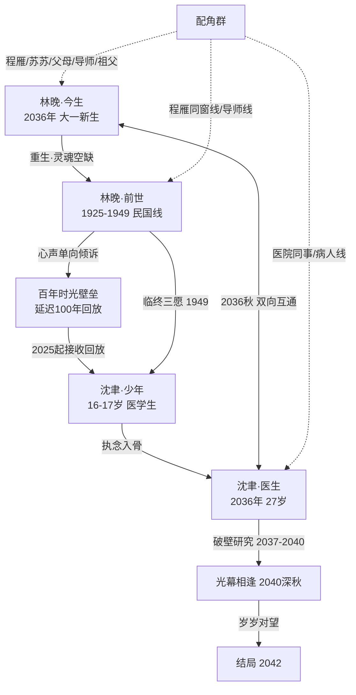

## 用户需求
对已完成的小说《百年回响，次元归途》（5 卷 15 章，位于 `novels/百年回响，次元归途/`）进行系统性全面审查，并输出一份完整的「扩充完善计划」文档。审查覆盖五个维度：

1. **时间线一致性**：核实事件顺序、时间跨度、时间标记（日期/季节/年龄），找出矛盾与跳跃，制定修正方案。
2. **人物关系梳理**：绘制人物关系图谱，检查互动逻辑、情感发展脉络与关系转变节点，补充缺失铺垫。
3. **伏笔填坑核查**：列出全部伏笔/悬念/未解之谜，逐一核对回收情况，标记未填坑项并规划填补方式与时机。
4. **情节丰富与扩充**：在保持原大纲框架不变的前提下，识别薄弱环节与生硬过渡，设计扩展情节、支线与过渡场景。
5. **细节描写优化**：针对关键场景、人物外貌心理、环境氛围提出优化方向，提升画面感与代入感。

交付物要求：问题清单、具体修改建议（标注受影响章节）、扩充内容规划、优先级排序（P0 逻辑硬伤 / P1 内容扩充 / P2 细节优化）。修改建议需提供「最小改动」与「最优方案」两档；保持 15 章结构与既有伏笔闭环不被破坏；先产出计划文档供确认，确认后再执行正文修订。

## 技术方案

### 一、审查方法论
依据 `novel-writing` 技能的 consistency-check 规范与 `outline-driven-novel` 技能的 baseline-template、storage-and-recovery 规范执行：以创作基线为唯一事实来源，对 15 章正文 + 大纲逐项交叉核验，输出按维度分类的问题清单与可执行修订方案。每处修改标注「最小改动（仅改正文表述）」与「最优方案（机制补全+正文+基线同步）」两档及受影响章节。

### 二、核心决策：时间线统一机制（最高优先级 P0）

**问题本质**：少年沈聿（17 岁）与民国林晚（1926-1949）的收听关系存在根本悖论——「实时收听 1926 年心声」与「听到 1949 年临终三愿后声音永寂」无法同时成立；且 27 岁沈聿处于「百年后」与「少年同代」之间矛盾。

**推荐机制：「延迟百年、1:1 回放」**——林晚的心声以 1:1 时间比例延迟一百年抵达现代，沈聿自 2025 年（16 岁）起逐年接收 1925 年起林晚的心声（同龄共鸣、浪漫对称），至 2049 年收完 1949 年临终三愿后「声音永寂」，字面满足「百年回响」。

**时间锚点（写入基线时间线表）**：
| 时间 | 沈聿 | 林晚 | 对应章节 |
| --- | --- | --- | --- |
| 1925 秋（十六岁雨夜） | — | 16 岁，心声始 | 第1章回溯 |
| 1926-1949 | — | 17 岁至暮年，单向倾诉、临终三愿 | 第1-4章（民国线） |
| 2025-2026 | 16-17 岁，开始接收回放 | — | 第2章（「三个月前」→「一年前」） |
| 2036 | 27 岁，权威脑外科医生 | 重生 18 岁，大一 | 第5-8章 |
| 2037-2039 | 28-30 岁 | 大二至大四 | 第9-12章 |
| 2040 深秋 | 31 岁，破壁成功 | 22 岁，毕业 | 第13-14章 |
| 2042 | 33 岁 | 24 岁，岁岁相守 | 第15章 |

**待修正的正文表述**：第2章「三个月前」改为「一年前」；第4章「一百年后，十七岁的沈聿」改为「多年以后……十七岁的沈聿」（或「一百年后」+ 年龄改「四十岁」，二选一，推荐前者以保持少年执念力度）；第12章「四年了……在一起四年了」改为「三年了」（破壁于大一秋，至大四七夕约三年）；第7章补「你在回放里听过她的名字」；基线时间线表与世界观规则同步补登「延迟回放」机制。

### 三、人物关系图谱（用户要求绘制）

**关系逻辑核查结论**：情感主线（单向倾诉→聆听→破壁→互恋→治愈→拉扯→相逢→相守）脉络成立；需修补三处缺失铺垫：第7章沈聿如何知道「林晚」名字（由回放中程雁称呼补足）；第4章「门被叩响」与第15章梦境「你别怕，我在听」设计为闭环——她弥留之际恍惚听见的，正是百年后沈聿在回放结束时对虚空说出的「我听见了」，经时光缝隙倒流嵌入她的最后意识；导师身份统一为同一人（神经科导师＝第13章导师）。

### 四、伏笔填坑台账（补登未登记项）
既有 F-01~F-06 全部回收；需补登 4 项半回收/未回收伏笔：
- **F-07 民国女校合影照片**（第4章埋、第5章提）：未明确即林晚——在第14章光幕相逢时由沈聿确认（照片中人即今生林晚），强化宿命感。
- **F-08 隔幕一吻「等你来还」**（第14章埋）：现世相守未兑现——标记为「番外坑3（婚后破壁番外）」承接，或第15章尾声给一句「他已在着手让壁垒彻底稳定」的开放钩子。
- **F-09 梦境记忆「你别怕，我在听」**（第15章）：随第4/15章临终呼应闭环一并回收。
- **F-10 大纲 4 个番外坑**：民国隐秘番外、少年沈聿番外、婚后破壁番外、宿命细节番外——列入「未填坑清单」，规划为正文修订完成后的可选番外阶段。

### 五、扩充规划（P1，保持大纲框架）
- **民国线（第3-4章过渡）**：插入历史节点画面——一二八事变（1932）、全面抗战与淞沪会战（1937）、租界孤岛（1937-1941）、西迁办学（1941 后）；补 1-2 个过渡场景（逃难路上、学堂里的孩子群像、一位受她影响的学生后来参军的呼应）。
- **现代线**：第8→9章补「身份认知交代」场景（林晚追问沈聿职业与生活，他回答医生）；第11章补一次「危机事件」（林晚生病/家中变故，沈聿隔着时空无力照料，张力爆发点）；第13章补「濒临放弃→再坚持」的关键时刻；第15章补「世人目光」支线（父母催婚、同事追问、相亲压力）与苏苏「最接近秘密的人」的喜感/紧张支线。
- **配角线**：苏苏（第9-13章出现、第15章消失——补一场毕业离别或她隐约察觉的戏）；今生父母（补一场电话戏）；沈聿祖父旧书箱（已用，可补一处情感callback）。

### 六、细节优化方向（P2）
- **意象系统**：雨、梧桐、月光、光幕四项核心意象全书贯穿——民国线以「雨与梧桐」承载易碎感，现代线以「月光与灯火」承载等待，破壁后「光幕」承载相逢，做首尾呼应式收束。
- **人物外貌**：前后世林晚容貌一致性（眉眼薄愁、眼底破碎感）需在正文出现具体锚点（如第6章重生描写时点明「和民国合影里一模一样」）；沈聿的「手」（手术刀的稳 vs 隔着光幕无法触碰的无力）做对比描写。
- **场景质感**：民国线补旗袍、电车、报童、石库门、老式洋行细节；现代线补手术室无影灯、深夜医院走廊、大学操场晚霞等感官细节；心理层面强化沈聿「手术台上掌控一切 vs 破壁前无能为力」的落差。

### 七、文件结构与实施约束
- 新增：`novels/百年回响，次元归途/扩充完善计划.md`（核心交付物，含问题清单/修改建议/扩充规划/优先级）。
- 修订：15 章正文按批次修改；`创作基线.md`（时间线表、世界观规则、伏笔表补登 F-07~F-10、变更日志）；`全书目录.md`（伏笔总览更新）；`进度.md`（标注修订状态）。
- 约束：保持 15 章结构与大纲框架不变；每批修订后跑一致性检查；全部文件 UTF-8；遵守 storage-and-recovery 命名规范。

## Agent Extensions

### Skill
- **novel-writing**
  - 用途：依据其 consistency-check、character-system、material-library 规范执行五维审查（时间线/人物/伏笔/情节/细节），并在正文修订后跑一致性复核。
  - 预期产出：问题清单判定依据、修订后的章节通过一致性检查。
- **outline-driven-novel**
  - 用途：依据其 baseline-template（基线十节结构、伏笔编号规则）与 storage-and-recovery（落盘/命名/进度）规范，同步更新创作基线、补登伏笔台账并维护进度文件。
  - 预期产出：基线时间线表与伏笔登记表（F-01~F-10）更新到位，全书目录与进度文件保持一致。
