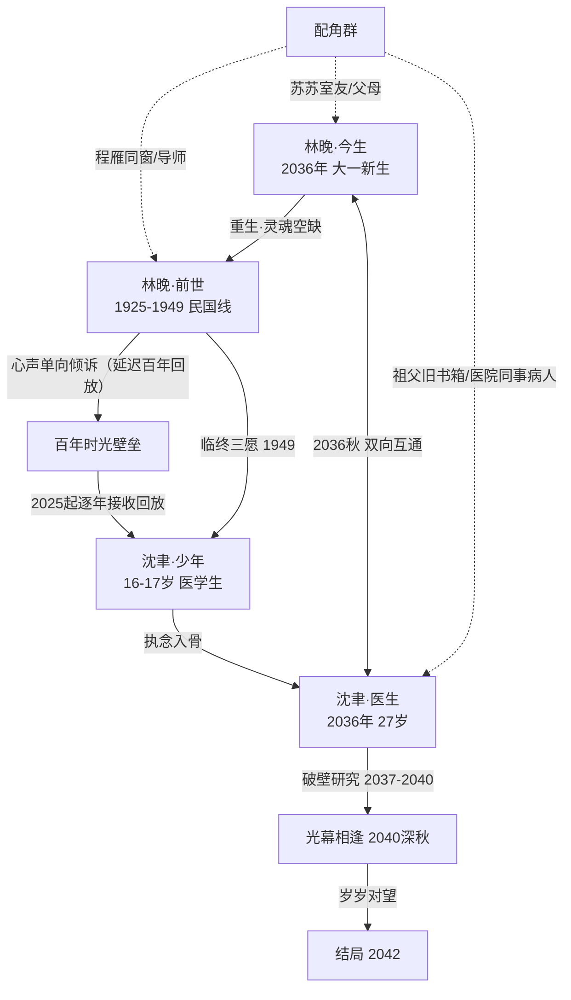

# 扩充完善计划：百年回响，次元归途

> 审查范围：全书 15 章正文 + 创作基线 + 全书目录 + 进度文件（5 卷 15 章，共约 3.5 万字）
> 审查方法：以《创作基线.md》为唯一事实来源，逐章交叉核验时间线、人物、伏笔、情节与细节
> 核心原则：保持 15 章结构与大纲框架不变；扩充不破坏既有伏笔闭环；修改建议提供「最小改动」与「最优方案」两档
> 审查日期：2026-08-19

---

## 一、审查总览

全书结构完整、情感主线（单向倾诉→聆听→破壁→互恋→治愈→拉扯→相逢→相守）脉络成立，F-01~F-06 六条登记伏笔全部回收。但经逐章核验，存在 **1 处根本性时空悖论、4 处时间标记错位、3 处人物逻辑漏洞、4 项未登记/半回收伏笔、10 处情节薄弱点**，另有系统性细节优化空间。

| 优先级 | 类别 | 数量 | 处理方式 |
| --- | --- | --- | --- |
| **P0** | 逻辑硬伤（时间线悖论、人物漏洞、伏笔闭环） | 8 项 | 直接修订正文 + 同步基线 |
| **P1** | 内容扩充（民国线、现代线、配角线） | 12 项 | 在原章节内插入扩展场景 |
| **P2** | 细节优化（意象、外貌、场景、心理） | 4 类 | 通读润色，批次执行 |

**最高优先级决策（P0 核心）**：统一「延迟百年、1:1 回放」的心声传递机制，一次性解决少年沈聿与民国林晚的时空悖论（详见第二章）。

---

## 二、时间线一致性审查

### 2.1 问题清单

| 编号 | 问题 | 位置 | 严重度 |
| --- | --- | --- | --- |
| T-01 | **根本性时空悖论**：少年沈聿（17 岁）与民国林晚（1926-1949）的收听关系无法自洽。「实时收听 1926 年心声」与「听到 1949 年临终三愿后声音永寂」不能同时成立；且「二十七岁的沈聿」若与少年沈聿同代，则百年后时间线无法锚定 | 第2/4/5章 | ★★★ |
| T-02 | 第12章「大学第四年，又是一年七夕」与「四年了……在一起四年了」的时间错位：破壁于大一秋，至大四七夕约 3 年而非 4 年；且七夕在 8 月、学年 9 月开始，「大四七夕」的学年定位需厘清（应为大三学年末或大四毕业前的表述） | 第12章 | ★★ |
| T-03 | 「三年数千次失败」的研究起讫不明：第11章（大二至大三）已出理论初稿，第13章研究「三年」——需明确三年计算口径，并与「沈聿 31 岁=林晚毕业年」（17→31=14 年）统一 | 第11/13章 | ★★ |
| T-04 | 第1章心声起点（十六岁雨夜=1925 秋）与第2章正文叙事起点（1926 秋十七岁）的关系未在正文中交代清晰，读者易误读为同年 | 第1/2章 | ★ |
| T-05 | 基线时间线表第4行注「（沈聿18岁后声音永寂）」与林晚活到 1949 年矛盾；第5章「一百年后」表述与少年沈聿同代冲突 | 基线+第4/5章 | ★★★ |

### 2.2 核心决策：统一「延迟百年、1:1 回放」机制（P0）

**机制定义**（写入基线世界观规则）：林晚的心声以 **1:1 时间比例延迟一百年** 抵达现代。沈聿自 2025 年（16 岁）起开始逐年接收 1925 年起林晚的心声——**同龄共鸣、浪漫对称**——至 2049 年收完 1949 年临终三愿后「声音永寂」，字面满足书名「百年回响」。

此机制的优势：一是彻底解决「实时收听」与「临终永寂」的矛盾（改为按年递进回放，临终三愿是回放序列的最后、最强一段）；二是年龄自然对称（16 岁听 16 岁、17 岁听 17 岁），强化宿命浪漫感；三是不破坏任何既有伏笔，仅需改数处时间表述。

**统一后时间锚点表**（写入基线时间线表）：

| 时间 | 沈聿 | 林晚 | 对应章节 |
| --- | --- | --- | --- |
| 1925 秋（十六岁雨夜） | — | 16 岁，心声始 | 第1章回溯 |
| 1926-1949 | — | 17 岁至暮年，单向倾诉、临终三愿 | 第1-4章（民国线） |
| 2025-2026 | 16-17 岁，开始接收回放 | — | 第2章（「三个月前」→「一年前」） |
| 2036 | 27 岁，权威脑外科医生 | 重生 18 岁，大一 | 第5-8章 |
| 2037-2039 | 28-30 岁 | 大二至大四 | 第9-12章 |
| 2040 深秋 | 31 岁，破壁成功 | 22 岁，毕业 | 第13-14章 |
| 2042 | 33 岁 | 24 岁，岁岁相守 | 第15章 |

### 2.3 修改建议

| 编号 | 最小改动（仅改表述） | 最优方案（机制补全+正文+基线） |
| --- | --- | --- |
| T-01 | 第4章「一百年后，十七岁的沈聿」改为「多年以后……十七岁的沈聿」；第2章「三个月前」改为「一年前」 | 上述改动 + 第5章补一句回放机制交代（如「这些年，他早已把她的声音听了二十余年」）+ 基线世界观规则补登「延迟回放」条款 + 时间线表更新 |
| T-02 | 第12章「四年了……在一起四年了」改为「三年了」 | 上述改动 + 厘清「大四七夕」为「毕业前最后一个七夕」的定位，与第13章毕业衔接顺滑 |
| T-03 | 第13章补一句研究起讫（如「自她大二那年初稿，三年有余」） | 上述改动 + 第11章注明初稿时间，形成「初稿→三年攻坚→毕业年成功」链条 |
| T-04 | 第1章补半句时间交代（如「那是十六岁的深秋，一年后她十七岁」） | 上述改动 + 基线时间线表第1行注明「1925 秋（十六岁雨夜回溯，非叙事起点）」 |
| T-05 | 删除基线注「（沈聿18岁后声音永寂）」 | 改为「（2049 年收完 1949 年临终三愿后声音永寂）」，与机制统一 |

**受影响文件**：第1/2/4/5/12/13章正文、创作基线（世界观规则+时间线表+变更日志）。

---

## 三、人物关系梳理

### 3.1 人物关系图谱

### 3.2 关系逻辑核查结论

情感主线五段式（单向倾诉→聆听→破壁→互恋→治愈→拉扯→相逢→相守）的转变节点全部有正文支撑，逻辑成立。需修补 3 处缺失铺垫：

| 编号 | 问题 | 位置 | 修改建议 |
| --- | --- | --- | --- |
| C-01 | 沈聿直接说出「你叫林晚，对吗？」，但前文未交代他如何得知名字——民国心声回放中程雁叫过「林晚」，但正文未写沈聿听到；民国合影照片下只写「沪上某女校，民国十五年春」无名字 | 第7章 | **最小改动**：第7章补一句「回放里，她的同窗程雁这样唤过她，他记得那个音节」；**最优方案**：另在第5章加一段沈聿翻看旧照片时默念「林晚」的细节，双锚点 |
| C-02 | 前世林晚临终「恍惚听见门被叩响」（第4章）与今生林晚梦里「你别怕，我在听」（第15章）的来源不清——沈聿从未在民国时代对她说过话 | 第4/15章 | **设计闭环**：她弥留之际恍惚听见的，正是百年后沈聿在回放结束时对虚空说出的「我听见了，你别怕」——经时光缝隙倒流，嵌入她最后的意识。第4章补「那声音太远，像隔了一百年」；第15章由沈聿点破「原来那年她听见的，是我」 |
| C-03 | 第2章神经科导师与第13章医院导师是否为同一人未统一 | 第2/13章 | 统一为同一人（神经外科权威，从少年时的引路人到成年的同僚兼导师），补一处「少年时他问过导师的问题，二十年后他已回答」的 callback |

### 3.3 需补足的关系铺垫（P1）

| 编号 | 关系 | 现状 | 扩充建议 |
| --- | --- | --- | --- |
| C-04 | 程雁（民国同窗） | 第3章嫁去香港再无消息 | 补 1 场第4章流离路上的回忆/信件 callback（程雁的信是他唯一的旧友音讯） |
| C-05 | 苏苏（现代室友） | 第9-13章出现、第15章消失 | 补第15章一场毕业离别戏 + 她「隐约察觉室友有秘密」的喜感细节 |
| C-06 | 今生父母 | 第6章出场后消失 | 补 1 场电话戏（母亲催婚/询问近况），作为第15章「世人目光」支线的一部分 |
| C-07 | 沈聿祖父 | 旧书箱工具化（第5章） | 补 1 处情感 callback：祖父当年收书箱时说过的话，与破壁成功形成隔代呼应 |

---

## 四、伏笔填坑核查

### 4.1 既有伏笔回收确认（F-01~F-06）

全部 6 条登记伏笔已回收，回收链条完整（详见基线伏笔登记表），无遗留。**确认无需改动**。

### 4.2 补登未登记/半回收伏笔

| 编号 | 内容 | 埋设 | 现状 | 填补方式与时机 |
| --- | --- | --- | --- | --- |
| F-07 | 民国女校合影照片 | 第4章埋、第5章提 | 未确认照片中人即林晚 | **第14章光幕相逢时**由沈聿确认（照片中人即今生林晚），强化宿命感——正文补一句对照 |
| F-08 | 隔幕一吻「等你来还」 | 第14章埋 | 现世相守未兑现 | **第15章尾声**给开放钩子（「他已在着手让壁垒彻底稳定」）+ 标记为「番外坑3（婚后破壁番外）」承接 |
| F-09 | 梦境记忆「你别怕，我在听」 | 第15章 | 来源不清 | 随 C-02 临终呼应闭环一并回收（第4/15章联动） |
| F-10 | 大纲 4 个番外坑（民国隐秘/少年沈聿/婚后破壁/宿命细节） | 大纲末尾 | 未写 | 列入「未填坑清单」，规划为正文修订完成后的可选番外阶段（优先级最低） |

### 4.3 未填坑清单（番外阶段）

1. 民国隐秘番外（程雁视角/办学细节）
2. 少年沈聿番外（2025-2036 接收回放十年的成长与执念成形）
3. 婚后破壁番外（F-08 承接，现世相见后的生活）
4. 宿命细节番外（前世今生容貌一致性、时光缝隙倒流的底层规则）

---

## 五、情节丰富与扩充规划（P1）

### 5.1 民国线扩充（第3→4章过渡，历史纵深感）

| 编号 | 位置 | 扩充内容 | 作用 |
| --- | --- | --- | --- |
| M-01 | 第3章末-第4章初 | 补 1932 一二八事变过渡画面（炮火惊碎课堂） | 时代压强显性化，避免 1930s→1949 硬跳 |
| M-02 | 第4章 | 补 1937 全面抗战与淞沪会战场景（电车停运、报童嘶喊、撤离上海） | 交代「流离之路」起点 |
| M-03 | 第4章 | 补租界孤岛（1937-1941）与西迁办学（1941 后）的 1-2 个过渡场景（逃难路上、学堂里的孩子群像） | 办学群像展开，呼应「读书育人」设定 |
| M-04 | 第4章 | 补 1 位受她影响的学生后来参军的呼应（信件/记忆） | 「育人」结出果实，强化主题 |

### 5.2 现代线扩充

| 编号 | 位置 | 扩充内容 | 作用 |
| --- | --- | --- | --- |
| M-05 | 第8→9章之间 | 补「身份认知交代」场景：林晚追问沈聿的职业与生活，他答医生 | 消除读者「她何时知道他是医生」的疑问 |
| M-06 | 第11章 | 补 1 次「危机事件」爆发（林晚生病/家中变故，沈聿隔着时空无力照料） | 拉扯张力从「情绪」升级为「事件」 |
| M-07 | 第13章 | 补「濒临放弃→再坚持」的关键时刻（深夜实验室、导师劝退、因她一句话重燃） | 研究过程戏剧化，避免一笔带过 |
| M-08 | 第15章 | 补「世人目光」支线（父母催婚、同事追问、相亲压力）+ 苏苏「最接近秘密的人」的喜感/紧张支线 | 结局落地感，二人如何面对现实 |
| M-09 | 第15章 | 补毕业离别戏（苏苏告别、林晚送别室友） | 收束现代线配角 |

### 5.3 配角线扩充（与 3.3 联动）

苏苏线（C-05）、今生父母线（C-06）、祖父 callback（C-07）、医院同事/病人线（沈聿手术台上的故事与「执念互文」）——均并入上表对应章节执行。

---

## 六、细节描写优化方向（P2）

| 编号 | 方向 | 具体优化 |
| --- | --- | --- |
| D-01 | **意象系统贯穿** | 四项核心意象全书收束：民国线「雨与梧桐」承载易碎感，现代线「月光与灯火」承载等待，破壁后「光幕」承载相逢——首尾呼应（第1章雨夜→第14章雨夜破壁→第15章光幕） |
| D-02 | **人物外貌锚点** | 前后世林晚容貌一致性（眉眼薄愁、眼底破碎感）：第6章重生描写时点明「和民国合影里一模一样」；沈聿的「手」做对比描写（手术刀的稳 vs 隔着光幕无法触碰的无力） |
| D-03 | **场景质感** | 民国线补旗袍、电车、报童、石库门、老式洋行细节；现代线补手术室无影灯、深夜医院走廊、大学操场晚霞等感官细节 |
| D-04 | **心理深化** | 强化沈聿「手术台上掌控一切 vs 破壁前无能为力」的落差；林晚「习惯对虚空倾诉」到「有人应答后不敢置信」的层次 |

---

## 七、优先级排序与执行批次

### 7.1 优先级总表

| 优先级 | 内容 | 项数 |
| --- | --- | --- |
| **P0** | 时间线统一（T-01~T-05）+ 人物漏洞（C-01~C-03）+ 伏笔闭环（F-07~F-09） | 8 项 |
| **P1** | 民国线扩充（M-01~M-04）+ 现代线扩充（M-05~M-09）+ 配角线（C-04~C-07） | 12 项 |
| **P2** | 细节优化（D-01~D-04）+ 伏笔台账补登（F-10 标记番外） | 4 类 |

### 7.2 执行批次建议

| 批次 | 内容 | 涉及文件 |
| --- | --- | --- |
| 批次一（P0） | 时间线机制统一 + 三处人物漏洞 + 临终呼应闭环 | 第1/2/4/5/7/12/13/14/15章 + 基线 |
| 批次二（P1） | 民国线 4 处扩充 | 第3/4章 |
| 批次三（P1） | 现代线 5 处扩充 + 配角线 | 第5/9/10/11/13/15章 |
| 批次四（P2） | 细节润色 + 意象收束 + 伏笔台账同步 | 全书 + 基线/目录/进度 |

每批次完成后运行一致性检查（consistency-check 规范），核对新增内容未破坏既有伏笔闭环与时间线。

---

## 八、实施约束与文件清单

### 8.1 约束
- 保持 15 章结构与大纲框架不变，仅插入/修改段落，不新增章节。
- 每处修改标注「最小改动」与「最优方案」，默认执行最优方案（机制补全+正文+基线同步）。
- 全部文件 UTF-8 编码；遵守 storage-and-recovery 命名规范。

### 8.2 文件清单
- 核心交付物：`novels/百年回响，次元归途/扩充完善计划.md`（本文档）
- 修订：15 章正文（按批次）、`创作基线.md`（时间线表、世界观规则、伏笔表 F-07~F-10、变更日志）、`全书目录.md`（伏笔回收总览）、`进度.md`（修订状态标注）
