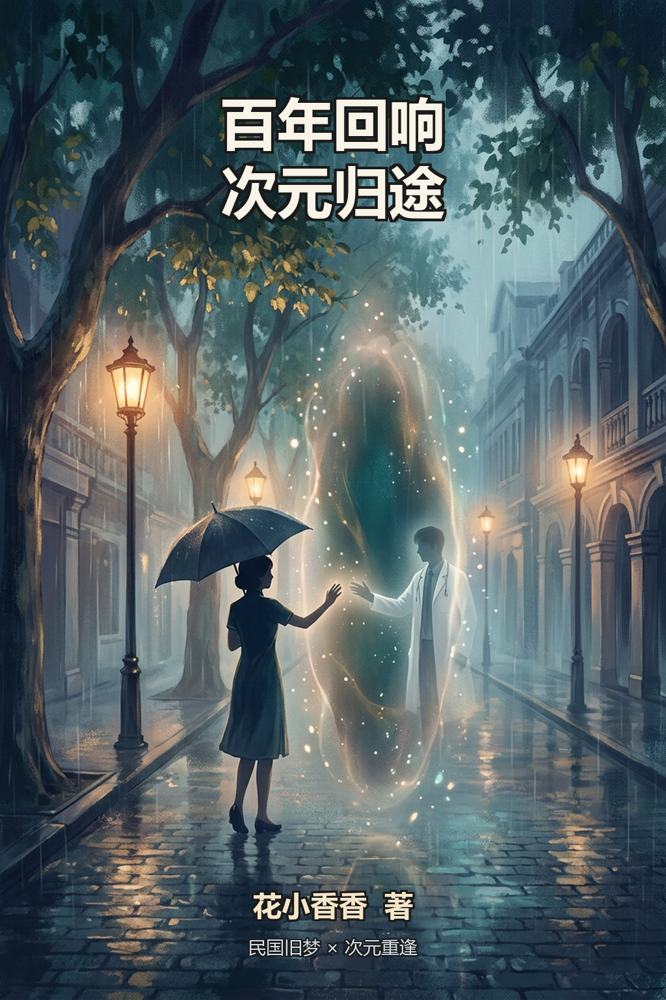

# 百年回响，次元归途

**作者：花小香香**

次元有壁，爱意无疆。百年回响，终有归途。

---

## 目录

- [第一卷 梧桐旧梦・百年无声](#vol1)
  - [第1章 一九二六，烟雨沪上](#vol1c1)
  - [第2章 乱世心事，尽付虚空](#vol1c2)
  - [第3章 单向时空，百年遥望](#vol1c3)
  - [第4章 乱世余生，遗憾落幕](#vol1c4)
- [第二卷 盛世重逢・次元共鸣](#vol2)
  - [第5章 百年沉淀，医生沈聿](#vol2c1)
  - [第6章 盛世重生，少女林晚](#vol2c2)
  - [第7章 次元破壁，双向互通](#vol2c3)
  - [第8章 第一声回应，百年如愿](#vol2c4)
- [第三卷 次元相恋・无人知晓的深爱](#vol3)
  - [第9章 独属于两人的秘密](#vol3c1)
  - [第10章 双向治愈，彼此救赎](#vol3c2)
  - [第11章 次元恋爱的极致拉扯](#vol3c3)
- [第四卷 星河七夕・百年一遇](#vol4)
  - [第12章 七夕星河，时空共赴](#vol4c1)
- [第五卷 破壁终章・岁岁归途](#vol5)
  - [第13章 执念成研，破壁之路](#vol5c1)
  - [第14章 百年破壁，终得相逢](#vol5c2)
  - [第15章 次元归期，余生相守](#vol5c3)
- [番外篇](#vol6)
  - [番外一 雨夜微光](#vol6c1)
  - [番外二 少年心事](#vol6c2)
  - [番外三 归期](#vol6c3)
  - [番外四 命中注定](#vol6c4)

---

## 第一卷 梧桐旧梦・百年无声 {#vol1}

### 第1章 一九二六，烟雨沪上 {#vol1c1}

梧桐叶大片大片落在法租界的柏油路上，被黄浦江上吹来的风卷着，一路翻进新式女校的雕花窗棂。民国十五年的上海，秋天永远带着潮湿的凉意，连空气里都浮着一层薄薄的、化不开的雾。

林晚坐在窗边第三排的位置，指尖轻轻按着一册《新青年》，书页的边角已经被她翻得起了毛。窗外的梧桐叶又落了一枚，擦过她的鬓发，她偏了偏头，没有伸手去接。

先生正在讲台上念着什么，声音隔着一层雾似的，听不真切。她的心思早已不在课堂上——或者说，她的心思从来就没在课堂上待过。

十七岁的林晚，是沪上最有名的教会女校的在读生。她出身书香旧家，父亲是留过洋的教书先生，母亲是识得字的旧式闺秀，这样开明的门第，让她得以入新学、读白话、观新世。在人人守旧、女子拘于深闺的年代，她是极少数能看见天光的人。

可天光太亮，衬得时代太暗。

她长相清丽温婉，眉眼自带一分薄愁，性子安静柔软，却骨子里坚韧。她不热衷社交周旋，不爱沪上浮华舞会，课余最爱独自靠窗静坐，看梧桐叶落了又长，看黄浦江的船走了又来。

同窗们都说她性子淡。可只有她自己知道，那份淡里藏着多深的东西。

"林晚，先生叫你呢。"同桌的程雁轻轻碰了碰她的手臂，又飞快地收回手，朝讲台上努了努嘴，一副"你走神被抓包了"的促狭模样。

她这才回过神来。先生正捻着粉笔，含笑望着她，问的是一句关于时局的看法——北伐的炮声已经隐隐传到长江下游，报纸上的论战一日比一日激烈，先生今日开讲的，正是"时局与人心"。

林晚站起来，先朝先生欠了欠身，声音温温软软的，却不卑不亢："学生以为，世道虽乱，人心不可乱。多一个人读书明理，这个国家便多一分指望。至于时局——学生人微言轻，说不好，只信一句：乱世最忌自乱。越是风雨飘摇，越要有人，稳稳地站着。"

教室里安静了一瞬。有人回头看林晚，也有人若有所思地低下头。

先生微微点头，眼底的赞许几乎藏不住："说得好。立身之本，先立其心。"他顿了顿，又笑着摇头，"林晚，你这份沉静，倒不像十七岁该有的。"

程雁悄悄拽她的衣角，压低声音笑："就你会说，先生每次都要夸你。我看呀，再夸几回，你都要成先生挂在嘴边的'典范'了。"

林晚也笑了笑，没答话。她只是觉得，乱世里的温柔，本身就是一种易碎。那些热血沸腾的演讲、振臂高呼的口号，她不是不懂，只是做不来。她更愿意把那些翻涌的心事，一点一点，咽进肚子里——像一颗种子，埋进最深最冷的土里，等一个谁也不知道的春天。

放学的钟声敲过三遍，天色已经暗了下来。同窗们三三两两结伴回家，路过霞飞路的霓虹灯，路过卖菱角的小贩，路过呼啸而过的电车。程雁在路口朝她挥手，喊她一道走，林晚摆摆手，示意自己还要再去一趟书肆。程雁知道她的性子，也不强求，只丢下一句"天冷，早些回去"，便挽着旁人的胳膊，没入人潮里。

林晚一个人走在梧桐树影里，脚步不急不缓。她其实并不打算去书肆——只是有些路，她总想一个人走。傍晚的风裹着黄浦江的潮气，拂过她鬓边的碎发。她伸手拢了拢，指尖碰到冰凉的发梢，才惊觉自己在风里，已经站了很久。

上海的夜，很快就要热闹起来了。舞厅的门帘掀开又合上，漏出一线暧昧的光；报童还在街角嘶哑地喊着号外；有黄包车夫拉着客人从她身边跑过，车铃叮叮当当响了一路；隔着一条街，隐约能听见留声机里靡靡的歌声，咿咿呀呀，唱得人心发软。

可林晚觉得，这一切都隔着一层什么。

她也说不清那层东西是什么。就像她心底那个声音一样，说不清，道不明。只记得热闹是热闹的，灯火是明亮的，可热闹与明亮底下，总有一小块地方，是冷着的、静着的、空着的——像一座没有访客的旧园，只等一个人，从很远很远的地方，慢慢走过来。

那是从十六岁那个雨夜开始的。

她还记得那个晚上。上海下了一场很大的秋雨，电闪雷鸣，雨点砸在瓦檐上，噼里啪啦响了一整夜。父亲病重的消息是傍晚传回来的，她一个人坐在堂屋里，听母亲在里间低声啜泣，听佣人蹑手蹑脚地添灯油，听雨声一层一层漫上来，把整座宅子泡成一座孤岛。她披着衣服坐在窗边，看着雨幕里模糊的街灯，忽然觉得说不出的孤独——那种孤独，和"身边有没有人"无关，更像是一颗心在深夜里，找不到可以安放的地方。

就在那一刻，她心底——真的就是心底，凭空浮起一道声音。

极稳，极清，极温柔。

像一片恒定不变的月光，静静地落下来。没有字句，没有说话，只是存在着，像一簇温温的火，守在寒夜的深处。窗外是电闪雷鸣的乱世，窗里是独坐无眠的少女，可那道声音落下来的时候，她竟莫名地，安了心。

她吓了一跳，以为是读书太倦、心绪郁结生出的幻听。可从那以后，日复一日，从未间断。她失眠的深夜、忧国的黄昏、想家的雨夜、迷茫的课余，那道声音永远在，沉寂、安稳，不属于这个动荡的人间。她偷偷掐过自己的手臂，疼；她故意整夜不睡，等它出现，它照样出现；她把它写进日记，又烧掉——它不像病，倒像一件旧衣裳上的补丁，贴着心口，谁也看不见。

她不敢告诉任何人。这样一个讲科学、讲新学的年代，说出去只会被人当作癔症。她把它当作自己一个人的秘密，藏得严严实实，只偶尔在深夜无人时，偷偷确认它还在——还在，就好。

入夜，女校的宿舍熄了灯。林晚躺在床上，听着走廊里细碎的脚步声渐渐远去，世界慢慢安静下来。

她轻轻闭上眼，那道声音果然又出现了。

像有一个人在很远很远的地方，隔着什么，陪着她。她不知道他是谁，不知道他在哪，甚至不知道他是不是真的存在。可她就是在那样一片无声的温柔里，慢慢安下心来。

窗外的雨又下了起来，淅淅沥沥，敲着梧桐叶。

林晚在心底轻轻说了一句话——她自己也说不清为什么要说，只是觉得，不说出来，心里那块地方就空着。

"你好。"

无人应答。

她没有失望，只是安静地听着雨声，听着心底那片无声的月光。过了很久，她又轻轻补了一句：

"不知道你是谁。但今晚，谢谢你陪着我。"

风声穿过窗棂，梧桐叶沙沙作响。没有人回答她，可她知道，那片温柔还在。

她忽然觉得，这乱世好像也没有那么孤单了。

屋外的雨下了一夜。林晚在雨声里睡着了，嘴角带着一点自己都不知道的弧度。而她在梦中所不知道的是，就在她心里那片无声的温柔对面——隔着整整一百年的时光，有一间医学院的宿舍里，一个十六岁的少年猛然从书桌前抬起头来。

他清冷的眉眼间，第一次浮现出近乎错愕的神色。

有什么东西，刚刚在他脑海里，轻轻响了一下。

像是远处有一扇门，被人推开了一条缝。

那扇门，已经很久很久，没有人敲过了。

### 第2章 乱世心事，尽付虚空 {#vol1c2}

民国十五年的冬天来得格外早。

街头时有游行，时有动荡。学生举着横幅从南京路上走过，口号声此起彼伏，人群像潮水一样涌过去又涌回来。报刊日日登载山河飘摇的消息，今天说北边开战，明天说南边失守，铅字印出来的每一个字，都带着火药味。

同窗里有人热血奔走，写了血书要去投军；有人惶恐避世，躲在闺房里绣嫁妆；有人早早定了亲，嫁去租界里求一份安稳。只有林晚，始终安静旁观。

她也说不上自己是什么心情。忧心是有的，悲愤也是有的，可她总觉得，比起冲上街头去喊口号，她更愿意做一点更安静的事——多读一本书，多记一行字，多收一颗种子，等这场乱世过去，再让它们发芽。

"你这个人，真是淡出清水了。"程雁抱着暖手炉来找她时，她正坐在窗边抄书，鼻尖冻得通红，"外头那么热闹，你倒好，躲在这儿写毛笔字。"

"热闹是他们的。"林晚放下笔，呵了呵手，"我替他们把书读着。等世道好了，总有用得上的时候。"

程雁歪着头看她，忽然叹口气："林晚，有时候我真觉得你心里装了太多事。你才十七岁，怎么活得像个小老太太似的。"

林晚笑了一下，没有接话。

她的心里确实装着事，一件天大的、不能对人说的心事。

每当深夜万籁俱寂，整座城市喧嚣落尽，她的心底就会浮起那道声音。极稳，极清，极温柔，像一片月光，恒定不变地落在她飘摇的岁月里。她试着把它当作幻觉，可幻觉不会这样日复一日、从不缺席。

她慢慢学会了和它相处。

起初只是在心里默默听，后来，她开始对着它说话。反正它从不回应，就像一面温柔的墙，什么话都能说，什么秘密都不会漏出去。

那阵子北边传来失守的消息，街上人心惶惶。林晚夜里睡不着，裹着被子坐在窗边，看着远处租界里明明灭灭的灯火，忽然很想问它一句。

"如果你真的存在，"她低着头，声音轻得像怕惊动什么，"你那里，是不是没有战乱？"

沉默。

"是不是百姓安稳，岁岁平安？"

还是沉默。

她不知道自己为什么会问这些。或许是因为，那道声音太稳、太静、太温柔，像极了太平年月里才能养出来的东西。她忍不住想，能拥有这样声音的人，一定活在一个人间安好的地方吧。

"我好想去看看，"她轻轻说，"那个不用害怕别离的时代。"

窗外的风呜呜地吹，梧桐叶早已落尽，只剩下光秃秃的枝丫在夜色里晃。她把脸埋进臂弯里，声音闷闷的：

"我这一生，怕是等不到盛世了。"

那句话说完，她自己先愣住了。

她不知道，她这每一句轻轻的叹息，都穿透了整整一百年的时光。

——

一百年后。

医学院的宿舍楼里，一盏台灯从黄昏亮到了深夜。

十七岁的沈聿坐在桌前，面前摊着厚厚一本《神经解剖学》，书页上密密麻麻写满了批注。他眉眼清冷，轮廓线条利落，是那种一看就知道不好接近的男生。

他的人生太早定型了。

少年时代便显出惊人的天赋，同龄人还在为一道物理题发愁，他已经能背下整本《人体解剖图谱》。老师把他当作天才培养，同学把他当作怪物疏远。他性格寡言，独来独往，在这个人人向往热闹的年纪，他永远一个人待着。

直到一年前，他的脑海里，突然闯进了一个声音——那是属于一百年前的声音，隔着一个世纪的漫长时光，被岁月封存了整整百年，直到他十六岁那年，才终于开始，在他耳边徐徐回放。

那是一个少女的声音。

温柔、清透，带着旧时代烟雨的味道。起初只是一些模模糊糊的叹息，像隔着一层水，听不真切。可最近，那些叹息越来越清晰，他能听见她说的话，一字一句，落在他的脑海里：

"如果你真的存在，你那里，是不是没有战乱？"

"是不是百姓安稳，岁岁平安？"

"我好想去看看，那个不用害怕别离的时代。"

他第一次听见这些话的时候，手里的解剖刀差点脱手。他以为自己学医太久，精神出了毛病——那些日子他翻遍了神经内科典籍，做了全套的脑部检查，排除了所有幻听的生理诱因，甚至去问了神经科的导师。

导师给他做完检查，只推了推眼镜说："沈聿，你的大脑很健康，比大多数人都健康。你听到的东西，医学解释不了。"

"那会是什么？"他问。

导师沉默了一会儿，才说："我活了六十年，见过太多解释不了的事。有些东西，医学给不出答案，不代表它不存在。"他顿了顿，又补了一句，语气淡得像在说一件寻常事，"沈聿，你还年轻。真遇上解释不了的东西，别急着当它是病——先听听，它想告诉你什么。"

沈聿一个人坐在空荡荡的检查室里，很久很久没有动。灯管嗡嗡地响着，白墙映着窗外沉沉的夜色。他低头看着自己的手，那双手将来是要握手术刀的，此刻却微微有些发颤。不是怕。是那种"终于有一样东西，连科学也解释不了"的、隐秘的震动。

他回想那道声音。她说"战乱"，说"山河"，说"盛世"，说"怕等不到"——这些词，不像一个现代女孩会说的话。那种措辞，那种语气，像是从一本很旧的书里走出来的。

他忽然想起自己小时候，在祖父的旧书箱里翻到过几册泛黄的民国报刊。上面的白话文，和那个声音说话的方式，出奇地像。

那一夜，他第一次没有做解剖题，而是坐在窗前，对着茫茫夜色，静静听完了那道声音所有的叹息。

少女说："我这一生，怕是等不到盛世了。"

声音里带着深深的、克制着的难过。

沈聿握着笔的手紧了紧。他不知道为什么自己会为一个素未谋面的、可能根本不存在的声音而心悸。明明只是一句叹息，明明隔着百年的时光，可那声音落进他耳朵里的瞬间，他竟觉得心口被什么温温软软的东西，轻轻碰了一下。

他只是忽然很想知道——

她是谁？

她经历了什么？

她说等不到盛世——她那个年代，到底乱成了什么样子？

她想看一个"不用害怕别离的时代"，而他就活在这样的时代里。这个认知，让沈聿没来由地难受。他低下头，指尖摩挲着书页边缘，一遍遍回想那句话——"我好想去看看"。她说得那样轻，那样小心，仿佛知道自己永远也去不了，只是说给自己听。

他想开口回应，张了张嘴，却发现自己什么也说不出来。那道声音像是从很远很远的地方传来的，他只听得见，却够不着。

他只能一遍一遍地听，把她的每一句话都记在心里。白天背书的时候记，深夜睡不着的时候记，连手术课上手在模型上缝线的时候，那句话也会忽然浮出来，让他的动作顿上一顿。

那一年的冬天，少年沈聿的书桌上，除了解剖图谱，多了一本泛黄的《民国史》。他开始查她提到的一切——她说的"沪上"，她说的"法租界"，她说的那些街名、地名、风俗。他像一个溺水的人抓住浮木，固执地想要证明：她不是幻觉，她真的存在过。

只是他还没有想明白，一个十七岁的医学生，要怎么跨越时间，去拥抱一个百年前的声音。

台灯的光落在书页上，窗外下起了雪。雪落在窗台上，一点一点积起来，映着台灯昏黄的光。

沈聿合上书，忽然听见脑海里那道声音又轻轻响了起来。少女像是睡着了，呼吸绵长，含含糊糊地呢喃了一句梦话：

"……也不知道，你听见了没有。"

他怔了一下。

然后他低下头，看着自己的手，极轻、极轻地说了一句只有自己能听见的话：

"我听见了。"

只是她听不见。

单向的时光，隔着一百年的长河，把两个人的心事，静静地隔在了两岸。可少年不知道，正是这一句无人知晓的应答，在许多年后，会成为另一个人漫长人生里，唯一一次抵达的回音。

### 第3章 单向时空，百年遥望 {#vol1c3}

民国的林晚，永远得不到回应。

她试过无数次的。在失眠的深夜，在空无一人的教室，在梧桐落尽的街角，她对着心底那片无声的温柔，轻声地问：

"你是谁？"

"能不能听见我？"

"你叫什么名字？"

"你……是不是真的存在？"

心底空空，唯有一片安稳的沉寂。

那道声音从来不答话。它像一面永远温柔的墙，接纳她所有的倾诉，却从不给她任何回音。久而久之，林晚也不再追问了。她把它当成自己独有的秘密树洞，把那些不能对任何人说的话，一句一句，都倒给它听。

乱世无人懂她的温柔，无人懂她的悲悯，无人懂她对太平盛世的执念。唯有虚空之中，有一位不知名的听者，岁岁聆听，不离不弃。

这世道一天比一天乱了。

先是程雁要嫁人了。男方家里在租界有些产业，开出的聘礼丰厚体面，程雁的父母几乎没怎么犹豫就应下了这门亲事。出嫁前一天，程雁拉着林晚的手坐在窗边，眼眶红红的，手里绞着一块绣了一半的帕子，半天没说话。

"林晚，我本来也想学你，多读几年书，替这个国家做点什么的。"她吸了吸鼻子，声音闷闷的，"可我妈说，女孩子读再多书，到头来还不是要嫁人。早点嫁了，至少能在这乱世里，换一份安稳。你说，我这样是不是很没出息？"

林晚想说什么，又咽了回去。她只是握紧程雁的手，说："你要好好的。"

"你也要好好的。"程雁抹了把眼泪，忽然又笑了，眼角还挂着泪珠，"你说你这人，性子这么淡，将来要嫁个什么样的人，才配得上你啊。我可替你愁着呢。"

林晚没有说话。她的目光落在窗外的梧桐树上，心里却浮起一个念头，像一片羽毛落在水面上，轻得几乎看不见——

她想嫁的，或许是那个一直陪着她、却从未真正出现过的人吧。

程雁嫁去了租界，喜轿起落，鞭炮声隔了两条街还听得见。林晚站在人群里，远远看着那顶红轿子抬进弄堂深处，忽然觉得，这一别，大概就是一生了。果然，后来听说夫家举家去了香港，就再没了消息。同窗们一个接一个地离散，有人出嫁，有人投奔亲友，有人热血上头去了前线，再也没有回来。昔日热闹的女校，渐渐冷清下来，钟声敲过，半天也聚不齐一间教室的人。

林晚的父亲在民国十六年的冬天过世了。

她记得那天很冷，上海的雨夹着雪，打在灵堂的瓦檐上。母亲哭得几乎晕过去，她穿着孝服跪在灵前，一滴眼泪都没有掉。直到夜深人静，所有人都散去了，她才一个人坐在父亲的旧书房里，看着满架的书发呆。

那些书是父亲留给她的。他临终前拉着她的手，气息微弱地说："阿晚，这世道，爹没能给你留下什么……只留了这一屋子书。你读着它们，将来不管走到哪一步，心里都要有光。"

她点了点头。

那晚她坐在父亲的书房里，听着窗外雨雪交加，忽然很想找人说说话。可她没有可以说话的人。她只能闭上眼睛，对着心底那片无声的温柔，一个字一个字地说：

"我没有爹了。"

"这世上，又少了一个疼我的人。"

"你……可不可以，也跟我说一句话？"

沉寂。一如既往的沉寂。

林晚闭着眼，眼泪终于落了下来。她不明白，为什么那个声音永远都在，却永远不肯回应她。她甚至开始怀疑，那是不是自己太过孤独，才臆想出来的依靠。

可她又舍不得怀疑。这乱世里，只有它，是她唯一的、不会离开的东西。

时局越来越差了。

民国二十一年春，闸北的炮声第一次惊碎了课堂。日军轰炸的飞机低低掠过城市上空，女校停了课，钟声被隆隆的轰鸣淹没。林晚站在校门口，看着逃难的人潮涌过梧桐树影，忽然想起程雁出嫁那天说过的话——乱世里，安稳是多么奢侈的东西。

战火从北边一路烧下来，上海的天空不再只有梧桐与霓虹，开始有飞机掠过的影子，有炸弹落下的轰鸣。林晚亲眼见过炸毁的街角，见过被抬走的伤者，见过一夜之间失去一切的普通人。

她渐渐明白了一个道理。

她这一生，生于乱世，注定颠沛，注定遗憾，注定看不到山河安定。

这个念头压在她心上，像一块沉沉的石头。她没有哭，也没有怨，只是在一个个深夜里，一遍遍地对着心底那道无声的存在，托付她这辈子最重要的话：

"若你真在未来，请替我好好活。"

"替我看山河无恙，看人间烟火。"

"替我感受岁岁平安，平安喜乐。"

她不知道对方是谁，不知道对方在不在，甚至不知道自己的话有没有人听见。她只是觉得，如果这个世界真的有那么一线可能——有一双耳朵，隔着一百年的时光，听到了她所有的遗憾——那么她这些碎碎念，就不算白说。

这是她留给未来、留给百年后、留给宿命爱人的百年托付。

林晚不知道的是，她这每一句托付，都一字不落地落在了那个少年的心里。

——

一百年后的医学院宿舍。

沈聿已经记不清这是第几次，在深夜里被那道声音定住了。

少女的声音越来越清晰，也越来越让人心碎。她说"我没有爹了"，说"可不可以也跟我说一句话"，说"若你真在未来，请替我好好活"——每一句，都像一根细细的针，扎在他心上。

他查遍了所有能查的资料。

神经科学告诉他，这不可能。物理学说，光速不可超越，时间不可倒流。他甚至动用了学长的权限，去翻了医学图书馆里所有关于"幻听""谵妄""精神分裂"的文献，一条一条对照，又一条一条划掉。

都不是。

她说话时，用词文雅，带着旧式学堂的味道；她提到的地名、街名、习俗，和他从祖父旧书箱里翻出来的民国报刊严丝合缝。一个现代的精神病患者，编造不出这样细密、自洽、充满时代气息的细节。

那不是幻觉。

那是真的。隔着整整一百年，有一个活生生的少女，在向他倾诉她的一生。

他不知道自己该高兴还是难过。高兴的是，她真实存在，且还在；难过的是，他什么也做不了。他试过回应的，在脑海里拼命地想：我在这里，我听见你了，你不要怕。可每一次，那道声音都像隔着一层永不可破的壁垒，只有她的话能过来，他的回应，一个字都过不去。

十七岁的沈聿，第一次尝到了"无力"的滋味。

他坐在台灯下，看着桌上那本被翻得卷了边的《民国史》，忽然伸手，轻轻抚过书页上"沪上"两个字。

"年少的我，"他对自己说，"没有办法跨过一百年去拥抱你。但我发誓，我会记住你说的每一句话。"

"我会记得你说，想去看没有战乱的人间。"

"我会记得你说，怕等不到盛世。"

"将来有一天，"他合上书，声音很轻很轻，"如果这世上真有办法——哪怕是天方夜谭——我也会想尽一切办法，让你听见，我回应你。"

窗外的月光静静地照着。

一百年前，少女对着虚空许下托付。一百年后，少年对着夜色立下誓言。

他们之间，隔着一条名为时光的河。河里的水，只能从过去流向未来，从未有过回流的可能。

可河的尽头，总有那么一天，会汇入同一片海。

### 第4章 乱世余生，遗憾落幕 {#vol1c4}

林晚的民国一生，温柔、干净、隐忍、孤独。

民国二十一年的一二八事变后，上海停战了几年，可谁都知道，那只是暴风雨前短暂的喘息。林晚守着父亲留下的书，在女校残存下来的几间教室里，教着越来越少的几个学生。她常常站在窗前，看着远处租界的方向，心里想：这样的安稳，还能撑多久呢。

民国二十六年，八一三的战火彻底烧穿了上海。昔日的霓虹街市沦为焦土，电车停在半路，报童嘶喊着的号外全是失守的消息。林晚在硝烟里收拾好父亲留下的书，随着人流，一步三回头地，离开了她生于斯长于斯近三十年的上海。

此后她辗转在上海周边的小城与乡间，守着一屋子书，办起了学堂。没有先生肯留下来的小镇，她便是先生；没有孩子读得起的书，她便把父亲留下的书一本本抄下来，分给愿意学的孩子。她教他们认字，教他们读诗，教他们明白：山河再破碎，人心里的光不能灭。

有人劝她："乱世里教什么书，女人家安安分分嫁人过日子才是正经。"

她只是笑笑，不说话。她心里那道光，从父亲去世那年起，就没有灭过。

那些年，她见过战火焚毁的村庄，见过倒在路边的伤兵，见过抱着孩子的母亲在废墟里哭，见过太多太多的人间疾苦。她帮不上什么大忙，只能在力所能及的地方，做一点一滴的小事——给逃难的孩子一口热粥，给受伤的兵士包扎伤口，给失去家园的人一句安慰。

那几年间，她短暂回过上海——租界成了孤岛，外面的炮声远了，城里的日子却没有好过。物价飞涨，米粮紧张，她在狭小的弄堂里继续教那几个孩子，把每一粒米、每一张纸都省着用。再后来风声更紧了，她随学堂一起西迁，一路颠簸，从上海到南京，从南京到武汉，再往西，翻山越岭，去了更远的地方。行囊里别的都可以丢，唯有那几箱书，她抱了一路，一本也没有少。

她始终心怀善意。

也始终，是一个人。

母亲也在逃难途中染了病，没能熬过那个冬天。林晚给母亲送了终，守完孝，又回到她那间小小的学堂。有人替她着急，托人给她说亲，说某某家的少爷，某某处的军官，都是体面的人家。她婉拒了一次又一次。

"你这孩子，到底要什么样的人？"说媒的婆子急得直跺脚，"你再挑下去，可就要挑成老姑娘了！"

林晚垂着眼，声音温温柔柔的："我心底，已经住着一个人了。"

"什么？"婆子愣住了，"哪家的后生？怎么从没听你说过？"

"他呀……"林晚顿了顿，轻轻笑了一下，"他不在这个世上。"

婆子只当她是在说丧气话，悻悻地走了。只有林晚自己知道，她说的是真话。她心底那个声音，陪她走过了少女时代，走过了丧父之痛，走过了颠沛流离，走过了整个乱世。他从未回应过她，可他从未来离开过。

她把这当作一种奇妙的缘分，也当作一种宿命般的孤独。

她这一生，从未遇见良人，心底永远住着一片虚空的温柔。

年岁渐长，操劳与忧思过早地熬白了她两鬓的头发，眼睛也常常看不大清书上的字了，只是背脊依然挺直——那是常年站在讲台上养出来的习惯。四十岁的人，看着倒比实际年长许多，可眉眼间那份温软，一分也没有少。学生们一个个长大成人，有的去了更远的地方，有的回来接她的班。她记得那个最安静的学生，临走前来辞行，说先生教他读的诗里有一句"国破山河在"，他读懂了。后来她收到过一封辗转寄来的信，寥寥几行，说他在队伍里，也在教人识字。她看了很久，把信收进怀里，没有告诉任何人。

她坐在学堂前的梧桐树下，看着那些年轻的面孔，恍惚间想起自己十七岁那年，也曾在这样的梧桐树下，对着一片虚空许愿。

"我这一生，"她常在晚风里，对着心底那片依然安静的声音，轻轻叹息，"从未有人回应我的心事。"

"唯独有一道远方的声音，陪了我一辈子。"

"也不知道，你是不是真的存在。"

"如果存在……你那边，现在是什么光景？"

"是不是已经没有战乱了？"

"是不是，已经是太平盛世了？"

她问了一辈子，那个声音也听了一辈子。她始终没有得到过答案。可很奇怪，到了最后几年，她反而不再那么执着了。她开始觉得，能被这样一片温柔陪着一辈子，哪怕从未得到回应，也算是一种圆满。就像学堂外那棵老梧桐，年年落叶，年年又发新芽——有没有人看见，它都在那里。

民国三十八年的秋天，梧桐叶又落了。

林晚知道自己大限将至。她没有害怕，只是有些舍不得——舍不得她那间小小的学堂，舍不得那些还等着她教字的孩子，也舍不得，那个陪了她一辈子的、从未开口过的声音。

临终前夜，窗外梧桐叶落，细雨绵绵，一如她十六岁那个雨夜初见它的模样。

她躺在病榻上，意识昏昏沉沉。恍惚间，她仿佛又回到了那个雨夜，一个人坐在窗边，听着雨声，心底浮起一片月光。

她轻轻闭上眼，用尽最后的力气，在心底说出了这一生最后的话：

"若有来生，愿我生于盛世。"

"愿我心事有人应答。"

"愿我，不再孤身一人。"

那一句，彻底锁死了百年轮回、宿命重逢。

雨声里，她的呼吸渐渐微弱下去。最后的意识里，她仿佛听见远处有什么声音在响——像是一扇门，终于被人从另一头，轻轻叩响了。门缝里漏进一句极轻极轻的话，轻得像隔着整整一百年。她没能听清每一个字，却莫名地，安了心——仿佛有人在她不知道的地方，把她这一生所有的沉默，都一字一句地，接住了。

她闭眼落幕，乱世终章。

——

一百年后。

十七岁的沈聿，在深夜的宿舍里，猛然惊醒。

他的脸上，不知什么时候，已经满是泪水。

他听见了她最后的话。那句"若有来生，愿我生于盛世，愿我心事有人应答，愿我不再孤身一人"，一字一句，清晰得像就在耳边。

然后，那道陪伴了他整个青春的声音，从此，再没有响过。

他等了三天，又等了三个月，等到春天过去，夏天过去，秋天过去。那个声音，再也没有回来。

他发疯一样地翻书，翻到双手发颤；他一遍遍地在脑海里喊她的名字——可他甚至不知道她叫什么名字。他只知道那是一个民国的少女，喜欢梧桐，喜欢读书，忧国忧民，终身未嫁，一世孤独。

他跪在窗前，声音嘶哑：

"你叫什么名字？"

"你在哪里？"

"你……还在吗？"

无人应答。这一次，轮到他体会她曾经体会过的一切了。

沈聿抬起头，看着窗外沉沉的夜色。良久，他伸手，慢慢擦去脸上的泪，一字一句，对自己说：

"我记住了。"

"我记住了你说过的每一句话。"

"你说，若真有来生，愿生于盛世——现在，盛世来了。"

"你说，愿心事有人应答——你所有的愿望，我都替你记着。"

"你说，愿不再孤身一人——"

他顿了顿，声音极轻，却重得像落进时光深处的一颗种子：

"那就让我，成为那个，回应你的人。"

风从窗外吹进来，卷起桌上的《民国史》。书页哗啦啦地翻过，停在某一页，上面印着一张发黄的老照片：一群民国女学生的合影，前排中间的女孩眉目温婉，眼底带着一点淡淡的、说不清的愁。

照片下方，一行小字：沪上某女校，民国十五年春。

沈聿的目光，落在那张照片上，久久没有移开。

## 第二卷 盛世重逢・次元共鸣 {#vol2}

### 第5章 百年沉淀，医生沈聿 {#vol2c1}

百年时光流转。

当年那个伏在医学院宿舍灯下、执拗地翻着民国旧报的少年，终究长成了许多人仰望的样子。

二十七岁的沈聿，是全国最年轻、最权威的脑外科主治医生。

手术室的无影灯下，他握着手术刀的手极稳，一寸一寸，剖开生命的禁区。他的冷静在业内近乎传奇——再凶险的病灶，到了他手里，都像是早已被算准的棋局。病人家属在手术室外哭作一团，他走出门，摘下口罩，声音平得像一潭水："手术很成功，家属可以放心了。"

那一刻，所有的哭声都变成了感激。有人要跪下来给他磕头，他伸手扶住，脸上没什么表情："不用。这是我该做的。"

同事私下里说他冷。三十岁不到就做到这个位置的人，大概都是这样的——冷静、克制、对情绪近乎吝啬。他不参加科室的聚会，不在朋友圈发生活动态，对谁都是公事公办的一张脸。

只有他自己知道，那张冷脸下面，压着整整百年的倾听与遗憾。

他学医，从来不止为救死扶伤。

十七岁那年，他听过一个少女的声音。她隔着百年的时光向他倾诉，说怕等不到盛世，说想去看没有战乱的人间，说若有来生愿生于盛世、愿心事有人应答。后来那声音消失了，再也没回来。他翻遍了史料，甚至找到了那张民国女校的合影——那是他少年时从祖父的旧书箱底翻出来的，老人说不清来处，只说是祖上传下的旧物；后来他又在图书馆的旧报刊合订本里，见到了同一张照片的印刷件，底下印着一行小字：沪上某女校，民国十五年春。他捧着那张泛黄的相纸看了很久很久，却始终没能知道，前排中间那个眉目含愁的女孩，叫什么名字。

从那天起，他学医的道路便多了一个隐秘的方向。

他要破解大脑与时空的秘密，破壁回应百年前的少女。

七年学医，三年从医。这十年间，他利用所有能利用的业余时间，研究神经共鸣、脑电波异常、时空悖论。他查阅了量子物理学家关于时间维度的假说，拜访过研究梦境与潜意识的心理学大家，甚至私下里把古今中外所有关于"心灵感应""前世记忆"的记载都翻了个遍。

科室的主任曾经撞见过他半夜待在实验室里，面前摊着一堆脑电波图谱和量子力学的论文，忍不住问："沈聿，你一个脑外科医生，研究这些做什么？"

他合上资料，神色如常："随便看看。手术做多了，想换换脑子。"

主任摇摇头，没再追问。全医院的人都知道沈医生工作狂，却没人知道他真正在等什么。

有时候深夜值班，做完一台大手术，沈聿会一个人站在住院部的落地窗前，看着这座城市的万家灯火。

一百年。这座城市早已不是他记忆里那个样子——他其实也没有记忆，他记得的，只是她描述过的样子：梧桐、石库门、黄浦江的雾、法租界的柏油路。现在的上海霓虹璀璨，高楼林立，可他总觉得，缺了点什么。

缺了一道声音。

那道温温柔柔的、带着旧时代烟雨味道的声音。

他偶尔会想，她到底是真实存在过，还是只是他少年时代一个太过深刻的梦。可每次动摇的时候，他都会想起她说的那些话——"我这一生，怕是等不到盛世了""若有来生，愿我生于盛世，愿我心事有人应答"。

盛世真的来了。

可她，又去了哪里？

是不是永远消散在岁月里，像那场下了一夜的秋雨，再也寻不回痕迹？

沈聿收回目光，转身回到办公室，拧亮台灯，继续翻开那本被他翻得起了毛边的笔记本。本子里密密麻麻，记的全是她说过的话、她提过的地名、他这些年的研究笔记。

他伸手，轻轻抚过扉页上的一行字。那是他十七岁那年，在那个失去她声音的夜晚，一笔一划写下的：

"我这一生，总要回应她一次。"

窗外，城市的灯火明明灭灭。

他不知道的是，就在这座城市某个角落，一间大学宿舍里，一个女孩刚刚拖着行李箱搬进新寝室，正站在窗前，好奇地打量着这个她无比熟悉、又无比陌生的世界。

她的眉目温婉，眼底带着一点淡淡的、说不清的愁。

她总觉得，自己好像等一个人，等了一辈子。

只是她还不记得，那个人是谁。

### 第6章 盛世重生，少女林晚 {#vol2c2}

盛世安稳，百年已过。

林晚这一世，生在太平人间。

她出生在一个再普通不过的家庭。父亲是中学语文老师，爱书成痴，书房里堆满了他淘来的旧书；母亲在图书馆工作，性子温吞，说话总带着点吴语尾音。家里住着不大不小的房子，过着不好不坏的日子。从小到大，她没经历过战乱，没忍过别离，没缺过吃穿。按照任何标准，她都该是个无忧无虑的姑娘。

没有人知道，她是怎样越过那六十九年的光阴，才重新来到这个盛世的——仿佛一捧被风卷走的灰烬，在时光的缝隙里蛰伏了许久，直到人间终于安定下来，才肯落回一朵花上。她本人也不知道。她只是知道自己来了，带着一身说不清的旧梦，和一块填不满的空缺。

可她的灵魂深处，天生带着一块空缺。

那种感觉很奇妙，像是心里破了一个小小的洞，怎么填都填不满。她说不清那是什么，只是总觉得，自己好像忘了一件很重要的事，等一个很重要的人。有时候走在街上，路过一棵老梧桐，她会莫名地停下脚步，盯着看了很久，心里泛起一阵自己也解释不了的酸软；有时候下雨的夜里，她本该安然入梦，却会忽然醒来，坐在窗前，觉得这样的夜晚，自己似乎坐过很多很多次。

小时候她把这感觉说给母亲听。母亲摸着她的头笑："傻孩子，你才几岁，哪有什么人等。是你动画片看多了。"

她自己也觉得荒谬，便不再说了。可那种感觉，从来没有消失过。

父亲倒是认真对待过她的"胡话"。有一回她对着窗外的雨发呆，父亲走过来，顺着她的目光看了一会儿，忽然说："晚晚，你要是觉得心里空，就去多读点书。书读多了，心里就满了。"后来她才知道，父亲年轻时就爱在旧书摊上淘民国旧刊，书架上那几册泛黄的《良友》画报，就是那时候攒下的。

她长大了。长相、眉眼、温柔的性格、轻微的孤独感、眼底淡淡的破碎感，都和某个人一模一样——和沈聿书桌抽屉深处那张民国合影里、前排中间那个眉眼含愁的女孩，一模一样。只是她自己不知道。她高考发挥正常，进了本市一所不错的大学，成了大一新生。

开学那天，校园里到处都是拖着行李箱的家长和叽叽喳喳的新生。校门口的横幅拉着"欢迎新同学"，志愿者学长学姐顶着太阳帮忙指路。林晚一个人办好入学手续，一个人把行李搬进四楼的寝室，一个人铺好床。室友的妈妈们热心地帮女儿们整理东西，抹布、收纳盒、家乡带来的零食，一样一样往外掏；她安安静静地待在自己的角落，把书一本一本地摆上架子，动作不快不慢，像是做过很多遍。

"林晚，你爸妈没来送你呀？"室友苏苏探过头来，她是个扎马尾、说话带笑的姑娘，刚到就和大家混熟了。

"嗯。"林晚笑了笑，"他们忙，我自己可以的。"

苏苏羡慕地说："你好独立啊。我爸妈恨不得跟我一起住进宿舍，连我的被子都要帮我一层层叠好。"

林晚没接话。她不是独立，只是习惯了一个人。从小到大，她几乎都是这么过来的——自己收拾书包，自己搬行李，自己决定晚饭吃什么。不是父母不爱她，是她总觉得，心里那些空落落的东西，谁也帮不上忙，只能自己扛着。

她不爱热闹，不喜群居。同学们在群里约着聚餐、唱歌、打游戏，她大多时候都婉拒。她更习惯一个人待着——一个人去图书馆，一个人去操场，一个人在晚风里散步。

她总觉得，自己好像一直在等一个永远没来的回应。

说不上来是在等谁。也说不出来要等什么。可那种空落落的感觉，就像刻在骨头里，甩不掉，也逃不开。

大一的第一学期，她过得安静而平淡。

课堂上她认真听讲，笔记写得工工整整；课后她独来独往，在图书馆一待就是一下午。有一天晚自习结束，她一个人走过操场，忽然听到远处传来一阵吉他声。几个男生围坐在草坪上唱歌，嗓音混着晚风，模糊又热闹。

她站在台阶上，看了一会儿。

不知道为什么，她忽然很想说点什么。对谁说呢？她也说不清。可能是对夜空，可能是对晚风，也可能，是对那个她不知道存不存在、却总觉得在某个地方的谁。

她轻轻吸了一口气，习惯性地自言自语：

"今天开学了。"

"校园挺大的。室友们人都很好。"

"就是……有点累。"

风把她的声音吹散在夜色里。没有人听见，她也不在意。从小到大，她早就习惯了这样对着虚空碎碎念。这是刻在她灵魂深处的本能，她自己都不知道从哪来。

她不知道，就在她说出那句话的瞬间——

城市另一端，医院的办公室里，沈聿握着钢笔的手，猛地顿住了。

有什么东西，很久很久没有响过的什么东西，在他脑海里，轻轻震了一下。

像是封存了整整一百年的琴弦，忽然被人，拨动了一根。

沈聿缓缓放下笔，整个人像是被定住了一样，一动不动。

那不是幻觉。他等了一百年——不，从十六岁那年听见她的第一声叹息起，他整整等了十一年——的那道声音，时隔百年，第一次，又在他耳边响了起来。

只是这一次，不再是民国烟雨里隐忍的叹息。

是鲜活、年轻、温柔、带着盛世烟火气的少女碎念。

她说的词，他几乎每一个都听不懂，却又觉得每一个字都像温热的泉水，涌进他荒芜了百年的心底。

"开学了……校园挺大的……室友们人都很好……就是有点累。"

沈聿的指尖，一点一点地发麻。

他慢慢抬起头，看向窗外。城市的灯火正一盏一盏地亮起来，晚风穿过窗缝，吹动桌上的笔记本，哗啦啦地翻到某一页。

那一页上，是他十七岁那年写下的字：

"我这一生，总要回应她一次。"

他盯着那行字，看了很久很久。

然后他听见自己心底，有一个声音，极轻、极轻地说：

"是你吗？"

"真的……是你吗？"

### 第7章 次元破壁，双向互通 {#vol2c3}

自从那天之后，沈聿的生活，彻底乱了。

那个少女的声音，隔三差五地出现。有时是上课的间隙，有时是深夜的自习，有时是食堂排队时的一句抱怨："今天的红烧肉也太咸了……"大多数时候，她只是在碎碎念，像极了在跟谁说话，又像是在说给自己听。

沈聿不敢出声。他怕惊扰了什么，怕那声音像百年前一样，忽然消失。他只是不动声色地听着，把她的每一句话，都小心翼翼地收进心里。

可他心里的震动，几乎要压不住了。

她说的那些话，他几乎全都听不懂。"高数好难""部门要团建""奶茶买一送一"——这些陌生的词汇，这个鲜活明亮的、属于盛世的声音，和他记忆里那个满口旧时代哀愁的民国少女，判若两人。

可又有一些东西，让他确信，就是她。

她说话时那种轻轻的、温软的语调；她深夜睡不着时对着虚空叹息的习惯；她偶尔冒出来的一句"总觉得心里空空的，好像忘了什么"——那是刻在灵魂里的东西，隔着一百年，也没有变。

沈聿开始失眠。

他深夜躺在值班室的床上，听着她的呼吸声。她能安然入梦，他却睡不着。他反复地想着同一个问题：她是谁？她在哪里？为什么她能听见……不，为什么他听不见她，她却能让他听见？

不对。

他忽然意识到一件更奇怪的事。

她好像，也能听见他。

那是入冬后的事了。大一的第一学期渐渐走到尾声，梧桐叶落尽，上海的风一日冷过一日。那天深夜，女孩又没睡着，在心底碎碎念："好烦啊，明天要交作业，可我一个字都写不出来。"

沈聿鬼使神差地，在心里回了一句："那就先睡一觉，明天再写。"

话一出口他就后悔了。他在心里说了十年的话，从没指望过有人能听见。

可下一秒，女孩的声音顿住了。

"……谁？"她的声音里带着一丝不确定，还有一点小心翼翼地试探，"谁在说话？"

沈聿愣住了。

他张了张嘴，喉咙干得发不出声音。他几乎不敢相信——百年了，从少年到青年，他在心里对她说过无数次话，这是第一次，她听见了。

他压下狂跳的心，一个字一个字地，在心里说："是我。"

"你是谁？"她的声音有些发抖，"你在我心里……对，你怎么会在我心里？"

沈聿的喉结动了动。那个名字，他其实早已知道——一百年前的回放里，她的同窗程雁唤过她无数次，温柔又亲昵。他记了许多年，却从未有机会说出口。

"我不知道该怎么说。"他的声音也跟着微微发颤，他深呼吸了好几次，才勉强稳住，"你叫林晚，对吗？"

沉默了很久。

久到沈聿几乎以为自己听错了、自作多情了。然后，他听见女孩带着哭腔的声音，轻轻地说：

"你怎么知道我的名字？"

沈聿仰面躺在值班室的床上，看着天花板，忽然就笑了。笑着笑着，眼眶就热了。

他不知道怎么解释。他不能告诉她，他听了她一百年的声音；不能告诉她，他曾对着她最后的心愿立下誓言；更不能告诉她，他花了十年时间，研究如何跨越时空去回应一个素未谋面的姑娘。

他只是说："我叫沈聿。从今天起，你心里的事，可以跟我说。"

"为什么？"她问，"我为什么……要跟你说？"

沈聿闭了闭眼。窗外城市灯火明灭，他听见自己用一种连自己都陌生的、温柔得近乎破碎的声音说：

"因为你一个人，说了太久了。"

"这一百年……不，这些年来，你一直是一个人。"

"现在，我听见你了。"

值班室的灯亮着，城市的夜很深。

女孩没有再说话。可沈聿听见，她哭了。她没有哭出声音，只是呼吸乱了，一下，又一下。他安静地陪着她，像一百年前，她安静地陪着他一样。

很久很久以后，她的声音才再次响起，带着一点鼻音，却认真得像是怕他反悔：

"沈聿。"

"嗯，我在。"

"你说你听见我了。"她顿了顿，"那我说什么，你都听吗？"

"听。"

"一辈子都听吗？"

沈聿握紧了手。

"一辈子都听。"

窗外的月光，静静地落进两个相隔百年的人心里。百年时光壁垒，在这一刻，终于被一道温柔的回应，轻轻凿开了一条缝。

而她不知道的是，那条缝，还会越开越大。

直到他们终于能，真正看见彼此。

### 第8章 第一声回应，百年如愿 {#vol2c4}

林晚还沉浸在自己的小情绪里。

她刚从图书馆出来，抱着两本厚得吓人的教材，一个人走在回寝室的路上。入冬的夜风有点凉，吹得她鼻尖泛红。她想起今天发生的一堆琐事：高数小测没考好，部门例会被学姐不轻不重地说了几句，食堂的糖醋排骨卖完了——鸡毛蒜皮，说大不大，说小不小。

"好烦。"她对着路灯下的影子，习惯性地自言自语，"今天真是诸事不顺。"

她等着那道已经渐渐熟悉的温柔声音回她——自从那个深夜之后，沈聿就变成了她心里一个奇奇怪怪的常驻居民。她上课走神，他就在心里提醒她"好好听课"；她熬夜刷题，他就低低地叹"去睡吧"；她考砸了委屈，他就温声说"下次会更好"。

她有时候觉得，这大概是她活了十八年，做过最离谱的一个梦。可她不敢戳破，怕戳破了，梦就醒了。

她没等到沈聿的声音。

"喂？"她在心里喊他，"沈聿？你睡着了吗？"

还是沉默。她心里咯噔一下，某种说不清的慌乱涌上来——他平时从不缺席的。她加快脚步，走了两步，又停下来，心底那道声音已经带了点颤："沈聿？你在不在？"

然后，下一秒。

她心底骤然响起一道声音。

低沉、温柔、稳如岁月，却又带着某种克制到极点的颤抖。

清晰，真实，穿透灵魂。

"我来了。"

林晚浑身一震，瞬间愣在晚风里。手里的教材啪地一声掉在地上，她却没有弯腰去捡。

那道声音，她太熟悉了。是她从小到大无数次恍惚听见、却从未清晰捕捉到的声音；是那个陪了她一个多月、温柔得像月光一样的声音。可今天的他，和平常不一样。

他说的不是"我在"，而是——

"我来了。"

像是这句话，他在心里排练了一百年。

"沈聿……"她张了张嘴，声音抖得不成样子，"你怎么了？"

他没有立刻回答。过了很久，久到林晚以为他要消失了，他才又开口。这一次，他的声音更轻，却每一个字都重得像要砸进她灵魂里：

"林晚，我等你这句话，等了很久了。"

"哪句话？"

"你说，'沈聿，你在不在'。"他顿了顿，"百年前，也有一个人，这样问过我。她问'你是谁，能不能听见我'，问了一辈子，我都没有办法回答她。"

林晚的心，忽然漏跳了一拍。

她不知道他为什么突然说起这些，可她心底深处，有一块一直空着的地方，莫名其妙地，酸了起来。

"你……"她听见自己问，"你在说什么呀？"

沈聿的声音温柔至极，带着被克制了百年的颤抖：

"你不用再等了。"

"我听见你了。"

那一瞬间，林晚说不上来发生了什么。

她只觉得，心里那块空了十八年的地方，忽然被什么东西，轻轻填满了。像是有一扇门，在很深很深的地方，被人从外面叩响了——她说不清那是记忆还是直觉，可她就是知道，她等的人，来了。

她蹲下去，捡起地上的书，却怎么也直不起身。眼泪毫无预兆地落下来，啪嗒啪嗒砸在书页上。她抱着书，蹲在冬夜的路灯下，哭得像个终于找到家的小孩。

沈聿没有说话。他只是安静地陪着她，像一百年前，她安静地陪着他一样。

不知道过了多久，林晚吸了吸鼻子，声音闷闷的："沈聿。"

"嗯。"

"你刚才说的那个……百年前的人，是谁呀？"

沈聿沉默了很久。

久到林晚以为他不会回答了，他才轻轻地说："一个民国的姑娘。她一个人在乱世里，对着虚空说了很多年的话，没有一个人回应她。临终前，她说，若有来生，愿生盛世，愿心事有人应答，愿不再孤身一人。"

"她许的那些愿，"沈聿的声音很轻很轻，"现在，都实现了。"

"盛世来了，所以她才来到这个时代。"

"心事有人应答——从今天起，她的每一句话，都有人听。"

"不再孤身一人——"

沈聿没有再往下说。

林晚抱着书，站在晚风里，眼泪又落了下来。她说不出为什么，可她就是知道，他说的那个姑娘，是她。

一定是她。

"沈聿。"她哑着嗓子喊他。

"我在。"

"你再叫一次我的名字。"

"林晚。"

"再叫一次。"

"林晚。"

林晚仰起头，看着头顶的星空。冬夜清寒，星河反而格外澄澈，像一整条银河都落在了她头顶。她忽然就笑了，眼泪还挂在脸上，嘴角却高高地扬起来。

"沈聿，你知道吗？"她说，"我总觉得，我等这一天，等了一辈子了。"

沈聿在那一头，低低地笑了。

"我也是。"

百年遗憾，尽数落地。

那一夜的城市，车水马龙，灯火如常。没有人知道，在这座城市的两端，有两个相隔百年的灵魂，第一次，真正听到了彼此的声音。

风从远方来，穿过他们的心间。

像是百年前梧桐树下的那场雨，终于，落到了今天。

## 第三卷 次元相恋・无人知晓的深爱 {#vol3}

### 第9章 独属于两人的秘密 {#vol3c1}

从那天起，他们开启了全世界最特殊的爱恋。

普通人的恋爱：见面、牵手、约会、拥抱、朝夕相处。
他们的恋爱：灵魂互通、心事互知、时空相隔、无法触碰。

林晚有时候觉得，自己大概是全天下最矛盾的姑娘。她明明从没见过沈聿长什么样，不知道他高不高、瘦不瘦、笑起来是什么样子，可她就是觉得自己在谈恋爱，谈得认真又投入，甜得能腻出蜜来。

早上起床，她会在心里小小声地说："沈聿，早。"

通常情况下，几秒之后，那道低沉温柔的声音就会回她："早。今天第一节有课？"

"嗯，高数。不想去。"她赖在被窝里，含糊地咕哝。

"去。"他的声音带着一点纵容的笑意，"高数不及格，期末会很难过。"

"知道啦。"她翻身坐起来，嘴上答应着，心里却甜丝丝的。从前她起床时，心里总是空空的，像是缺了点什么；现在，她的早晨从第一句"早安"开始，就变得满满当当。

上课犯困，她趴在桌上，在心里小声嘟囔："沈聿，我好困。"

"昨晚又几点睡的？"他的声音带着一点无奈，"下课了就去吃点东西，别趴在桌上睡，会着凉。"

"你比我妈还啰嗦。"她嘴上嫌弃，眉眼却弯弯的。同桌苏苏推她："林晚，你一个人笑什么呢？"

她吓得赶紧坐直，清了清嗓子："没、没什么。老师讲得好笑。"

苏苏狐疑地看了她半天，没再追问。林晚偷偷松了口气。这是她和沈聿之间最大的秘密——全世界没有第二个人知道，她心里住着一个叫沈聿的人。

刷题崩溃的时候，她在心里哇哇叫："这道题也太难了吧！我怀疑我和高数有仇！"

沈聿淡淡地："放平心态，一道题一道题来。我高中时候刷题，也是这么过来的。"

"你高中时候是不是学霸？"

"嗯。"

"学霸都这么气人的吗？"

他低低地笑了一声，那笑声像一根羽毛，轻轻搔过她的心尖。林晚忽然就脸红了，低下头假装看题，心跳却快得像要蹦出来。

食堂的饭难吃，她吐槽："今天的土豆炖牛肉，牛肉大概只有三粒。"

"那多吃点饭。"他顿了顿，"周末去外面改善一下伙食。"

"我一个人去吃饭，好孤单。"

"我陪你。"他的声音温温柔柔的，"我在你心里，不一直陪着吗？"

林晚忽然就不说话了。她低着头，用筷子戳着碗里的土豆，眼眶有点热。过了好一会儿，她才小声说："沈聿。"

"嗯。"

"你说，我们什么时候才能见面呀？"

他没有立刻回答。过了很久，他才说："会见的。我保证。"

这句话说出口的时候，沈聿自己先愣了一下。他从来不是随便许诺的人——手术台上，他只对病人说"我会尽力"，从不把话说满。可对着她，那两个字几乎是不假思索地溜出来的。话一出口，他就知道，这不再是一句空话。

那天夜里，值班室的灯熄了很久，他仍然睁着眼。他想起她说的每一句"想见你"，想起自己十七岁那年对着夜色许下的誓，忽然觉得，那些被压在心底十几年的念头，像春天的种子一样，一夜之间，全都顶破了土。

林晚没有追问。她不想让他为难，也不愿让他难过。可那句话问出口的时候，她心里那个被填满的角落，还是悄悄裂开了一条缝。

她想要的不止是一道声音。

她想要见他。

想看看他长什么样，想牵一次他的手，想在难过的时候，被他抱一抱。

可她把这些念头都咽了回去。她已经很满足了——全世界最懂她的人，永远在灵魂深处陪着她。这已经是她从前做梦都不敢想的事了。

那天夜里，她终于问出了那个憋了很久的问题："沈聿，你到底是做什么的呀？"

"医生。"他说，"脑外科。"

"哇。"她忍不住惊叹，"那你岂不是每天都在救人？"

"嗯。"他顿了顿，"每天都有很多病人在等我。"

"那你一定很厉害。"她认真地说，"能被你救到的人，都太幸运了。"

沈聿沉默了一会儿，忽然轻轻地笑了："林晚，如果有一天我能见到你，你会不会嫌弃我，只是一个整天泡在手术室里的医生？"

"怎么会！"她想都没想，"医生多酷啊。比那些只会说情话的人酷多了。"

他低低地笑，没有再说话。可林晚却在那一声笑里，听出了藏得很深的温柔——他大概从来没有向任何人，这样坦诚过自己。

医院的深夜里，沈聿刚做完一台大手术，靠着墙闭着眼休息。他听着她一天下来的碎碎念：上课、刷题、食堂、社团、想家、深夜emo——那些细碎的小事，像温热的溪流，一点一点，把他冰冷的世界焐暖。

他睁开眼，看着头顶惨白的灯，忽然想：他这一生，等过她十年，听过她百年，走过漫长的寂寞。可直到遇见她，他才真正明白，原来一个人的心里，可以有这么满的温度。

他轻轻开口，在心里说："林晚。"

"嗯？"她好像正要睡着，声音软绵绵的。

"今天辛苦你了。"

"还好啦。"她含含糊糊地，"你才辛苦，这么晚还在医院。快去睡觉。"

"好。"他应着，却没有动。

林晚那边安静了一会儿，忽然又响起她轻轻的声音，像在说梦话：

"沈聿。"

"嗯。"

"晚安。"

"晚安。"

窗外的月亮，挂在两座城市的上空，照着两个相隔百年的人。

他们之间没有玫瑰，没有电影，没有肩并肩的散步。可他们的爱，落在每一个清晨的早安里，落在每一句深夜的晚安里，落在每一次"我懂你"的回应里。

全世界最特殊的爱恋，也是全世界最深的温柔。

只是，越是甜，越衬得那道无法跨越的距离，锥心刺骨。

### 第10章 双向治愈，彼此救赎 {#vol3c2}

苏苏说，林晚变了很多。

大一刚入学那会儿，她总是一个人，安静得像一株长在角落里的植物，不声不响，存在感低得可怜。可不知道从什么时候起，她变了——话变多了，笑变多了，上课敢举手回答问题了，社团活动也愿意参加了。

"林晚，你最近是不是谈恋爱了？"苏苏终于忍不住问她，"你整个人都在发光。"

林晚被呛了一口水，耳根通红："没有！谁说的！"

"少来。"苏苏眯着眼打量她，"你以前周末都窝在寝室，现在天天往外跑，说是去图书馆。可你回来的时候，嘴角都压不住——我可观察你很久了。"

林晚心虚地低下头，盯着杯子里的水，说不出话。

她没法告诉苏苏：她确实是谈恋爱了。只是她恋爱的对象，不在这个世界上的任何一个角落，而在她的心里。

前世的前世，她孤独一生，心事无人听。今生的今世，她有人岁岁倾听，事事回应。

那些从前压得她喘不过气的情绪，如今都有了一个温柔的去处。

期中考试周，她复习到崩溃，趴在图书馆的桌上，心里闷闷地说："沈聿，我觉得我考不好了。我可能真的不是读书的料。"

"你复习得很认真，我都看在眼里。"他的声音沉稳而笃定，"考试考的是心态。深呼吸，先休息十分钟，再把错题过一遍。"

"万一还是考不好呢？"

"考不好也没关系。"他说，"你还是那个很棒的林晚。分数不能定义你，我能。"

林晚愣了一下，然后悄悄把脸埋进臂弯里，闷闷地笑了。他总能这样——在她觉得自己一无是处的时候，告诉她，她很好。

她慢慢从敏感、怯懦、孤独，变得开朗、温柔、坚定。她开始敢在课堂上表达自己的观点，敢在部门里提出自己的想法，敢在室友闹矛盾的时候出面打圆场。她不再是那个缩在角落里的姑娘了。

而沈聿，也在悄悄改变。

科室的同事最先察觉。

"沈医生最近，好像没那么冷了。"护士长端着茶杯，跟旁边的同事咬耳朵，"上个月他收了个小病人，做完手术，居然主动给人家买了个棒棒糖。"

"真的假的？"

"真的！我还以为我看错了。他以前做完手术就走，一句话都不多说的。"

沈聿自己也知道自己变了。从前他的人生只有手术、研究、和那道永远听不到的执念；现在，他的人生里多了一个活生生的、会撒娇会委屈会碎碎念的小姑娘。

他依然冷静，依然克制，依然站在手术台前就是整个科室的主心骨。可他的心里，多了一团温温的火。

只有他自己清楚那团火从何而来。从前他的人生是一条笔直的、没有岔路的轨道：读书、手术、研究、等一个也许永远等不到的回声。他从不觉得苦，因为他早已习惯把所有的情绪都压进最深的角落里，像压一箱陈年的书。是林晚一点一点，把那些压着的、冷着的角落，重新焐热了。

有时候下夜班，他一个人走在空荡荡的医院走廊里，累得眼皮打架，可只要一想起她今天说的某句话——"沈聿，我今天在食堂吃到超级好吃的糖醋排骨！"——他的嘴角就会不受控制地弯起来。

他开始期待下班。期待回到那个能和她说话的地方。期待她叽叽喳喳地跟他分享一天的鸡毛蒜皮。

同事都说沈医生这两年温柔了很多。没人知道，他的温柔，只给次元那头的百年少女。

有一天深夜，林晚问他："沈聿，你今天累不累呀？"

"还好。"他顿了顿，"今天收了一个急诊，脑出血，抢救了四个小时。"

"那你现在还好吗？"她的声音一下子紧张起来，"病人救回来了吗？"

"救回来了。"他说，"家属一直在外面哭，手术做完，我去告诉他们没事的时候，他们差点给我跪下来。"

"那你有没有很累？"她轻声问，"我听说你们医生做手术，一站就是好几个小时。"

"累。"他难得诚实，"不过，现在跟你说说话，就不累了。"

林晚心里酸酸的，又甜甜的。她想了想，认认真真地说："那以后你累了，就找我说话。我虽然不能帮你做手术，但我可以帮你分担一点累。"

沈聿低低地笑了："好。"

前世的沈聿，年少执念，百年空憾。今生的沈聿，终于接住了那跨越时光的温柔。他不再是只剩理性的手术刀，心底有了烟火，有了牵挂，有了温柔的软肋。

他们隔着百年的时光，互相治愈，彼此救赎。

只是每一次治愈的背后，都藏着一个他们都不愿说破的痛——

他们明明拥有彼此，却永远无法拥抱彼此。

### 第11章 次元恋爱的极致拉扯 {#vol3c3}

他们的爱，甜蜜又煎熬。

甜蜜在：全世界最懂你的人，永远在灵魂深处陪着你。
煎熬在：永远不能见、不能碰、不能公开、不能相拥。

那天晚上，林晚一个人在寝室刷剧。剧里的男女主角在雨中重逢，男主脱下外套罩在女主头上，两个人笑着闹着，一路跑进屋檐下。镜头切得很近，雨滴砸在女主脸上，男主抬手，轻轻替她擦去。

林晚看着看着，忽然就沉默了。

她关了剧，躺下来，盯着天花板，在心里轻轻喊："沈聿。"

"嗯？"他的声音立刻响起，温柔又耐心，"怎么了？"

"我今天看到一部剧，里面的男女主角在雨里接吻了。"她顿了顿，声音有点闷，"他们真好啊，想见面就见面，想拥抱就拥抱。"

沈聿没有立刻说话。

"沈聿，"她又喊他，声音带着一点委屈的鼻音，"我想看看你长什么样。"

"我想和你一样，牵一次手。"

"我难过的时候，想被你抱一下。"

每一个字，都像一把钝钝的刀，一下一下，割在沈聿心上。

他是能救万人性命的天才医生，手术台上，没有他跨不过去的坎，没有他解决不了的病灶。可唯独这道薄薄的次元壁垒，他跨越不了。

他抱不到他的小姑娘。

沈聿沉默了很久，久到林晚以为他不会再说话了。然后他开口，声音低低的、哑哑的，带着一种拼命压着的温柔：

"林晚，对不起。"

"你为什么要道歉？"她慌了，"我没有怪你的意思，我就是……我就是有点想你。特别特别想。"

"我知道。"他说，"我也想你。每天每时每刻都在想。"

他顿了顿，又说："你说的那些，我全都想给你。我想见你，想牵你的手，想在你难过的时候把你抱进怀里，想让你知道，这世上有人愿意为你挡风遮雨。可是林晚……我做不到。"

"我现在做不到，但我一定会想办法。"

"你信我吗？"

林晚把脸埋进枕头里，眼泪无声地落下来。她吸了吸鼻子，声音闷闷的、软软的：

"信。"

"沈聿，你说的话，我都信。"

变故来得毫无预兆。

那是大二那年冬天的一个深夜，窗外下着细雨，林晚忽然发起高烧。室友们都回家过周末了，整间宿舍只有她一个人，连杯热水都够不着。她一个人蜷缩在宿舍床上，浑身滚烫，喉咙干得说不出话，迷迷糊糊间，只觉得天花板的灯晕一圈一圈荡开，晃得她心慌。

她撑着爬起来，裹了件厚外套，叫了车去医院。深夜的急诊室里人来人往，挂号窗口前排着长队，有人捂着肚子蹲在墙角，有人抱着孩子满脸焦急，护士推着轮椅小跑着穿过走廊，喊号的声音混着此起彼伏的咳嗽，嘈杂得让人头晕。她排了快四十分钟的队，才轮到她；又等了许久，才挂上水，一个人坐在急诊室的走廊里，冰凉的液体一滴一滴流进血管，激得整条手臂都发冷。窗外雨声淅沥，她忽然就哭了——不是怕生病，是怕自己一个人扛不过去的时候，那个说好要陪她一辈子的人，连一杯热水都递不到她手上。

"沈聿。"她在心底喊他，声音带着浓重的鼻音，"我难受。"

沈聿的声音立刻响起来，带着彻骨的慌乱："你怎么了？你在哪？"

"医院。"她吸了吸鼻子，"发烧了，在挂水。"

他沉默了很久。她听到他那边有椅子挪动的声音，有脚步来回走的声音——他大概想立刻冲过来，却不知道她在哪座城市，哪家医院，哪一间急诊室。

"林晚。"他的声音哑得厉害，"对不起。我没能照顾好你。"

"不怪你。"她摇头，"你又不能飞过来。"

"可我想。"他说，"我真的很想。哪怕只是在你身边，替你拧一瓶水，替你掖一下被角。"

走廊的灯惨白地亮着，林晚握着手机，忽然觉得手里的液体都凉了。她曾经以为，只要心里有他，什么都可以忍。可这一刻她忽然明白——爱，是需要形状的。它需要一只手，一个拥抱，一杯深夜的热水。

她张了张嘴，想说什么，又咽了回去。只是轻轻地说："沈聿，你答应我，一定要找到办法。"

"我一定会的。"他的声音轻而坚定，"我不会让你，再一个人扛了。"

那一夜，他陪她在急诊室的走廊里，一直坐到天快亮。

那晚之后，沈聿开始了他漫长而隐秘的尝试。

他找遍了神经科学、量子物理、心理学领域所有可能的方向。他通读了国内外关于脑电波、神经网络、意识与时空的一切前沿论文，在实验室里待到深夜，一遍一遍地设计、推翻、再设计。

他不敢告诉她太多。他怕给了她希望，最后又让她失望。

可林晚还是感觉到了。

他回她的消息越来越晚，说话越来越简短。她半夜醒来，偶尔能"听见"他那边翻书页的声音、敲键盘的声音、纸笔摩擦的声音。她问他："沈聿，你最近是不是很忙？"

"嗯，"他含糊地应，"医院的事有点多。"

"你骗我。"她轻轻说，"你以前忙的时候，也会跟我说一声'今晚要加班，晚点回你'。可你这几天，说话的时候都心不在焉的。你是不是……在做什么不想让我知道的事？"

沈聿沉默了一会儿，低低地笑了："什么都瞒不过你。"

"林晚，我确实在做一件事。但我想等它有了结果，再告诉你。"

"那会有结果吗？"她问。

"会的。"他认真地说，"只要我还活着一天，我就不会放弃。"

林晚没有再追问。她只是轻声说："沈聿，你做什么我都支持你。但你答应我，别太累。你要是累垮了，谁陪我说话呀。"

"好。"他应着，声音里带着温柔的笑意，"我答应你。"

窗外的月光静静地照着。

林晚抱着枕头，听着他那边安安静静的呼吸声，心里又酸又甜。她当然知道他在做什么——他一定是在找办法，想见一面，想拥抱她，想兑现他许过的诺言。

她相信他。就像她相信，那个她等了很久很久的人，一定会来。

只是她不知道，那一天，还要等多久。

而沈聿的实验室里，台灯彻夜亮着。桌上的草稿纸已经堆了厚厚一摞，最上面的一张，密密麻麻画满了复杂的波形图，角落里用钢笔写着一行字：

"跨时空脑波共振——理论初稿。"

他放下笔，揉了揉酸涩的眼睛，看着窗外渐渐泛白的天色，在心里轻轻地说：

"林晚，等我。"

"我一定能找到，去见你的路。"

## 第四卷 星河七夕・百年一遇 {#vol4}

### 第12章 七夕星河，时空共赴 {#vol4c1}

大三升大四的那个暑假，又是一年七夕。

校园里满是浪漫的烟火气。花店的玫瑰花卖到脱销，男生们捧着花束在女生宿舍楼下排队，操场上有人摆着蜡烛和气球，晚风里飘着烤串和奶茶的香气。朋友圈里刷屏的都是合照、玫瑰花和"在一起的第N年"。

林晚一个人靠在宿舍窗台上，看着楼下成双成对的人影，忽然有些出神。

快三年了。她和沈聿，以这样奇特的、无人知晓的方式，已经在一起快三年了。

她毕业设计也快完成了，论文改了一稿又一稿。三年前那个怯生生的、习惯一个人缩在角落里的大一新生，如今已经能自信地站在讲台上答辩。她变了很多，唯一没变的，是心里那个温柔的存在，和她对一段真正的、可以触碰的恋爱的渴望。

"又是七夕了。"她趴在窗台上，在心里轻轻说，"别人都有相逢，我们永远隔时空。"

沈聿没有立刻回她。

林晚也不催。她知道，他今天有一台高难度的手术，从下午一直排到深夜。她安静地趴在窗台上，看着楼下的热闹，听着自己心里空空的回音。

她等啊等，等到楼下的人群渐渐散去，等到月光爬上树梢，等到寝室熄了灯，室友们都睡熟了。

她的手机屏幕忽然亮起来。她低头一看，是沈聿发来的消息。

她和他之间，很少用手机联系——毕竟，他们之间隔着的是次元，不是距离。可他偶尔也会给她发消息，发他拍的月亮，发他办公室窗台上养的一盆绿萝，发一张模糊的、加班时拍的夜景。

这一次，他发来的是两张照片。

一张是月亮。隔着医院的落地窗拍的，月亮圆圆的，挂在高楼之间，清冷又温柔。

另一张是手。修长、骨节分明，指尖带着一点消毒水的气息——他刚下手术台，手还没来得及洗。

"林晚，刚刚做完手术。"他附了一行字，"今天七夕，没能陪你，补你一张月亮。"

林晚捧着手机，看着那两张照片，忽然鼻子一酸。

她抱着手机，缩在被窝里，在心里说："沈聿，你累不累？"

"累。"他的声音过了一会儿才响起，带着疲惫的沙哑，"十个小时的手术，刚下来。不过还好，病人救回来了。"

"那你快休息呀，都这么晚了。"

"你呢？"他问，"七夕快乐。今天……有没有人约你？"

林晚愣了一下，笑了："有啊。班上一个男生，还给我送了一束花。"

"哦。"他顿了顿，声音听不出情绪，"然后呢？"

"然后我告诉他，我有喜欢的人了。"她小声说，"他问我是谁，我说，是一个……很好很好的人。只是他现在还不方便见我。"

沈聿那边安静了很久。

他能听见她那边热闹的背景音——楼下隐约有男生起哄的声音，有人放了烟花，一声一声，炸开在夜风里。他知道，此刻这座城市里，有很多人正成双成对地走着，手牵着手，说着普通又甜蜜的话。而他的女孩，一个人趴在窗台上，等了他一整个晚上。

久到林晚以为自己说错了话，他才开口。声音低低的，带着一种被岁月熬煮过的温柔：

"林晚，对不起。"

"你又道歉。"她嘟囔，"我说过，不用道歉的。"

"我今天做完手术，一个人站在办公室的窗前，看着满城的灯火，忽然很想你。"他说，"我知道今天七夕，所有人都成双成对，只有你一个人。"

"我多希望，此刻能站在你身边，哪怕什么都不说，只是陪你看一会儿月亮。"

林晚的眼眶一下子就红了。

她吸了吸鼻子，努力让自己的声音听起来轻松一点："那你就当陪我看了嘛。你看，你拍了月亮，我也在看月亮。我们看到的，是同一个月亮呀。"

"别人一年一会。"她学着他的语气，"我们百年重逢。他们短暂，我们永恒。"

沈聿低低地笑了。

"你说得对。"

那一夜，林晚没有睡觉。她搬了把椅子，坐在宿舍的窗台边，看着外面的月亮。沈聿也没有睡，他坐在办公室的落地窗前，隔着城市的灯火，看着同一轮月亮。

她吃糖，他尝甜。她望月，他同辉。她相思，他奔赴。

夜风穿过窗台，林晚在心底轻轻说："沈聿，你知道吗？我从前总是觉得，自己这辈子大概要一个人过了。可遇到你之后，我才发现，原来等的滋味，也可以是甜的。"

"因为我等的是你。"他说，"只要最后是你，等多久都值得。"

"那要是永远等不到呢？"她轻声问。

"不会的。"他说，声音轻而坚定，"我已经找到方向了。林晚，你再等我一段时间。"

"好。"她笑着点头，眼泪却顺着脸颊滑下来，"我等你。"

百年前无人应答的七夕心愿，百年后尽数圆满。

星河落满两重时空，月光照进两颗心里。他们隔着一百年的距离，在同一个夜晚，看同一片星光。

那是他们漫长岁月里，最温柔的节日。

也是他们破壁之前，最后一个，只能隔空相望的七夕。

## 第五卷 破壁终章・岁岁归途 {#vol5}

### 第13章 执念成研，破壁之路 {#vol5c1}

四年时光，如白驹过隙。

林晚顺利毕业了。她褪去了大一时的青涩，站在毕业典礼的草坪上，穿着学士服，眉眼温柔笃定，笑起来的时候，眼睛里盛满了光。她把学士帽高高抛向天空，看着它在阳光里划出一道弧线，忽然在心里说：

"沈聿，我毕业啦。"

"恭喜你。"他的声音带着温柔的笑意，从她心底响起，"林晚，你做到了。"

她毕业那天，没有鲜花，没有拥抱。可她在心里听见的那句"恭喜你"，比任何鲜花和拥抱都让她安心。

四年前，她还是那个怯生生、总是缩在角落里的大一新生；四年后，她已经能从容地站在人前，规划自己的人生。苏苏说她是"脱胎换骨"，只有她自己知道，这四年的每一步，都有一个人，在看不见的地方，稳稳地托着她。

散场的时候，苏苏抱着她不肯撒手："林晚，你要常回来看我！不许有了男朋友就忘了我！"

"知道啦。"她笑着应。

"还有，"苏苏忽然压低声音，神神秘秘地凑到她耳边，"你那个神秘对象，我虽然没见过，但你每次提起他，眼睛都在发光。林晚，你是真的很幸福吧？"

"嗯。"她认真点头，"很幸福。"

"那就好。"苏苏松开她，眼眶却红了，"那我就可以放心走了。你要是受了委屈，随时给我打电话。"

林晚用力点头，看着她拖着行李箱走向校门。夕阳把她的影子拉得很长，也把林晚的大学时代，一起带走了。

而沈聿，这四年，也在走他自己的路。

他很少跟她提工作以外的事。她只知道他依然很忙，忙得经常深夜才回她的话。她偶尔半夜醒来，能"听见"他那边敲键盘的声音、翻资料的声音，有时还有仪器运作的低鸣。

她隐隐觉得，他在做一件大事。

那件事，和他曾经说过的"找到方向了"有关。

她猜对了。

沈聿确实在做一件大事。他用两人的百年灵魂共鸣为隐秘样本，数年如一日，深耕脑科学、神经共鸣、时空脑波研究。

这个想法，最初只是一个荒唐的念头：既然他们能隔着百年听见彼此，那么，属于他们两个人的脑电波，一定存在某种特殊的共振频率。如果能捕捉、放大、锁定这种频率，是不是就能在某个瞬间，撕开时空的缝隙？

他把这个想法告诉过导师——就是近十五年前，那个为他做完检查、告诉他"医学解释不了"的神经科前辈。如今他成了医院里最年轻的主刀，而那位老人，成了他唯一愿意袒露执念的人。

导师沉默了很久，问："沈聿，你是我们医院最优秀的外科医生。你确定要把时间和精力，投入这样一个……没有先例的方向？"

"我确定。"他说。

"科学上，这可能是一条死路。"导师提醒他。

"我知道。"沈聿抬起头，眼神平静，"但如果这条路能通，我这一生，就没有遗憾了。"

导师叹了口气，没有再劝。他看得出，这个一向冷静自持的学生，眼睛里有一种他从未见过的、近乎偏执的光。

那道光，叫执念。

实验开始了。

他把所有业余时间都泡在实验室里。深夜的实验室空无一人，只有仪器的嗡鸣声和他自己的呼吸声。他记录下自己每一次听到她声音时的脑电波变化，绘制成图谱，一条一条地比对，一次一次地失败。

三年。自她大二那年，他将那个荒唐的念头写成第一份理论初稿起，整整三年，他失败了几千次。

科室的同事劝他："沈聿，你疯了。你放着好好的专家不当，整天研究这些神神叨叨的东西。"

他没有反驳。他知道自己在做什么，也知道自己为什么要做。

可也有过那么一个深夜，他盯着屏幕上第几千次失败的数据，第一次动了放弃的念头。他把所有图纸和记录锁进柜子，坐在空荡荡的实验室里，问自己：如果这条路真的走不通呢？如果科学到不了她身边呢？

他想起那晚她一个人在急诊室挂水，声音哑哑地说"你又不能飞过来"。

他想起更早以前，那个民国的少女，在乱世里问了一辈子"有没有人听见我"。

他重新打开柜子，把图纸一张一张铺回桌面。

有些路，就算看起来是死路，他也得走到头——因为路的尽头，有个人在等他。

他赌上了职业生涯，赌上了所有科研成果，赌上了一切，只为一件事：

打破次元，见他的小姑娘一面。

他想起那个冬夜，林晚在心底委屈地说："我想看看你长什么样。我想和别人一样，牵一次手。"

他想起那个七夕的深夜，她趴在窗台上说："别人都有相逢，我们永远隔时空。"

他想起更久以前，那个民国的少女，一个人在乱世里，对着虚空许愿："若有来生，愿我生于盛世，愿我心事有人应答，愿我不再孤身一人。"

他不能让那些愿望，落空。

某个深秋的深夜，实验室的仪器忽然发出一声从未有过的长鸣。

沈聿猛地抬起头。屏幕上的波形图剧烈跳动，形成一种他从未见过的、规律的共振图案——与他记录的、她的脑电波频率，严丝合缝地重叠在一起。

他屏住呼吸，盯着屏幕，指尖微微发颤。

跨时空脑波共振。

成了。

他缓缓闭上眼睛，听到自己胸腔里那颗心，跳得又重又快。他等这一天，从十七岁，等到三十一岁。整整十四年。

他掏出手机，想把这个消息告诉她。可编辑了几行字，又全部删掉。

不。他想给她一个惊喜。

他要在见到她的那一刻，亲口告诉她：林晚，我找到你了。

他放下手机，走到窗边。深秋的夜空清朗，城市的灯火倒映在玻璃上，像一片星河。

他在心里，极轻、极轻地说：

"林晚，再等我一下。"

"很快，我就能见到你了。"

### 第14章 百年破壁，终得相逢 {#vol5c2}

深秋，雨夜。

城市灯火静谧，雨丝斜斜地打在窗玻璃上，洇开一片模糊的光。

自那个共振被捕捉锁定的深夜之后，沈聿把那台粗笨的仪器拆了装、装了拆，一遍遍地校准参数、加固光幕，终于在数日后的又一个深秋雨夜，让仪器稳定得足以支撑一场完整的相见。此刻，他站在实验室中央，面前是那台他亲手组装调试了无数个日夜的设备。显示屏上，波形图缓缓跳动着，发出平稳的嗡鸣。他检查了一遍所有参数，深呼吸，然后按下了启动键。

"林晚，"他在心里说，"如果今晚成功了，你就能见到我了。"

"如果失败了……没关系，我还有很多个夜晚。"

设备发出低沉的轰鸣，四周的空气开始扭曲。他看到自己面前的空间，像水面一样荡开一圈一圈涟漪。

与此同时，城市另一头。

林晚刚刚洗完澡，正坐在窗前擦头发。窗外下着雨，雨声淅淅沥沥，让她想起很多年前的某个夜晚——她也说不清是哪个夜晚，只是心里忽然涌起一股说不清的悸动。

"沈聿。"她轻轻喊他，没来由地，"你在吗？"

没有回应。

她皱了皱眉，又喊了一声："沈聿？"

还是沉默。她的心忽然揪紧了——这种沉默，让她想起将近四年前那个冬夜，她也是这样喊他，然后等来了那声"我来了"。

"沈聿！"她的声音带上了慌张，"你怎么了？你应我一声！"

就在她几乎要哭出来的时候——

她心底，忽然响起一道声音。

不再是隔着时空、若有若无的虚影。而是清晰的、真实的、近得仿佛就在耳边的声音：

"林晚。"

"我在。你别怕。"

林晚愣住了。她张了张嘴，却一个字也说不出来。因为她感觉到，有什么东西，正在她眼前缓缓成形。

实验室里，沈聿面前的空气中，一道光幕缓缓亮起。

那道光是透明的，像一层薄薄的水膜，又像一面打碎的镜子重新拼合。光幕里，有雨丝、有灯火、有模糊的剪影——那是另一个世界，另一个时代。

他屏住呼吸，一步一步走向光幕。

而光幕的另一边，林晚也看见了。

她窗外的雨幕，忽然被一片奇异的光芒撕开。光芒里，渐渐浮现出一个画面：一间亮着暖灯的实验室，仪器在运转，一个修长的身影站在光幕中央，正一步一步，向她走来。

她手里的毛巾"啪"地掉在地上。

时空缝隙剧烈波动，百年时光长河缓缓重叠。光影交错，民国烟雨与现代霓虹重叠，旧岁梧桐与今世星河相融。隔着那层透明的时光光幕，她第一次，看见了那个声音的主人。

清俊挺拔，眉眼温柔，是陪她两世岁月、百年相守的人。

他也终于看清了她。

亭亭玉立，眉眼温柔，是前世烟雨里夜夜许愿的少女，是今生盛世温柔的姑娘。

他忽然想起那张泛黄的合影——民国十五年春，沪上某女校，前排中间那个眉眼温婉、眼底含愁的女孩。那是他少年时从祖父的旧书箱底翻出来的旧物。老人摩挲着那口书箱，说箱子里的东西是他这辈子最放不下的念想，可惜他老了，翻不动了。后来他长大些，又在图书馆的旧报刊合订本里见到同一张照片的印刷件，才确认那不止是老人的念想——而是真的有过那样一个女孩。如今，照片里的人，和此刻光幕那头的姑娘，一模一样。原来当年那个替祖父翻书箱的少年，亲手把书里的故事，续到了另一个时代。

原来他一直找的人，就是她。

光幕之间，两人遥遥相望。

伸手可触光影，却隔百年岁月。

沈聿站在光幕前，看着她的脸。他找了她整整十四年——不，他等了她整整一百年。他张了张嘴，喉咙却像是被什么堵住了，一个字也说不出来。

反倒是林晚，先笑了。眼泪顺着她的脸颊滑下来，她却笑得很用力，声音又哑又软：

"沈聿。"

"嗯。"他终于找回自己的声音，一个字，却说得千回百转。

"我总算是……"她吸了吸鼻子，"看见你了。"

"嗯。"沈聿也笑了，眼角微红，"我也是。看见你了。"

他们隔着光幕，静静对望。雨声穿过两个世界，落在他们脚边。

沈聿深吸一口气，抬起手，轻轻贴在光幕上。他的声音低沉温柔，带着被岁月熬煮过的所有深情，一字一句地说：

"林晚。"

"百年前，你许愿盛世，我无声聆听。"

"百年间，你轮回等待，我执念不休。"

"百年后，我破壁而来，赴你余生所有温柔。"

林晚哭得泣不成声。她抬起手，隔着光幕，与他掌心相对。明明隔着百年的时光，她却仿佛能感觉到他掌心的温度。

"沈聿。"她哑着嗓子，"我等你这句话，等了好久好久。"

"我知道。"他说，"对不起，让你等了这么久。"

"不晚。"她摇头，眼泪却止不住，"一点都不晚。"

光幕外，雨还在下。

百年时光，在这一刻，终于交汇。

他伸手可触光影，却隔百年岁月。可那又怎样呢？至少，他看见她了。她看见他了。他们之间那道横亘了整整一个世纪的壁垒，终于在今晚，被他们的执念，撕开了一条温柔的口子。

林晚忽然说："沈聿，你往后走一点。"

他愣了一下，依言后退半步。

然后她踮起脚尖，隔着那层光幕，轻轻地、轻轻地，在虚空里，落下一个吻。

"这是欠你的。"她的脸红透了，声音却倔强，"第一个吻，先记着账。等我见到你本人，再还你。"

沈聿怔怔地看着她，忽然低低地笑了。他笑起来很好看，眉眼弯弯，眼里的光，比窗外任何一个时代的灯火都要亮。

"好。"他说，"我记着。"

"连本带利，等你来还。"

### 第15章 次元归期，余生相守 {#vol5c3}

壁垒不会永久消失，却会为他们偶尔相通。

那次破壁之后，沈聿的实验室里多了一样东西——一台他亲手设计、用以维持两界共振的仪器。它不能让人真正穿越时空，却能在特定的时刻——某个雨夜，某个清晨，某个晚霞漫天的黄昏——为两个世界撕开一道短暂的光幕。

他们拥有了短暂相逢、光影相见、岁岁对望的专属机缘。

从那以后，林晚的手机相册里，存满了同一个场景的照片：那间亮着暖灯的实验室，和玻璃后面的那道身影。相册有个单独的文件夹，名字她起了很久，最后只写了两个字："归期"。

她依然不能碰他，不能抱他，不能和他并肩走在街上。可她已经很满足了——能看见他，能对他笑，能隔着一层光幕，看他在实验室里走来走去，看他偷偷把她的照片摆在办公桌上，看他值完夜班困得直打哈欠还强撑着跟她说话。

她学会了挑他下夜班的空档在光幕前等他，学会了给他带一句"今天食堂的汤不错"这样的小事，学会了把生活中的每一件琐碎都攒起来，留给见面那几分钟说。他也学会了在她值夜班的深夜里，隔着光幕替她温一杯水——虽然那杯水，只能温在他那边。

"你困了就去睡。"她隔着光幕瞪他，"我又跑不了。"

"我怕我睡了，你就走了。"他看着她，眼神温温的，"等我确认你再待一会儿，就去睡。"

"幼稚鬼。"她嘟囔，嘴角却压不住。

有一次，她深夜加完班，拖着疲惫的身子走过路灯下，忽然很想他。她停下来，对着虚空轻轻喊："沈聿，我想你了。"

几秒钟后，他那边传来动静。她抬头，看见前方的夜色里，凭空浮现出一片淡淡的光晕——那是他连夜赶回实验室，启动了共振设备。

他站在光幕那头，穿着还没来得及换下的白大褂，头发有点乱，眼底有熬夜的青影，声音却温柔得像三月的风：

"林晚，抬头。"

"我在这儿。"

林晚站在深夜的路灯下，隔着那片光，看着那个为了她一句话就赶回实验室的人，忽然觉得，这世上大概再也没有比这更浪漫的事了。

世人不懂他们的爱。

可他们也不需要世人懂。

有一次，她的同事无意中问起："林晚，你条件这么好，怎么一直单身呀？"

她笑了笑，说："我有对象啊。"

"啊？"同事瞪大眼睛，"真的假的？怎么从来没见你带出来过？"

"他……"她想了想，认真地说，"他在很远很远的地方。我们一年也见不了几次。但我们的感情，比很多人都要深。"

同事听得一愣一愣的，最后说："那、那你们怎么维持感情啊？"

林晚弯起眼睛："我们有心电感应啊。"

同事当她开玩笑，哈哈大笑。林晚也跟着笑，没有解释。

她说的每一句，都是真的。

母亲也催过她。电话里，母亲欲言又止："晚晚，你那个对象，到底是什么人呀？都这么久了，也没见你带回来让我们看看。"

"他忙。"林晚笑着说，"而且他住得远。"

"多远？"

"嗯……"她想了想，认真地说，"隔着一百年那么远。"

母亲在电话那头沉默了，大概只当她在开玩笑，最后叹了口气："行吧，你高兴就好。妈就是怕你一个人，委屈了自己。"

挂断电话，林晚看着窗外，心里软软的。她怎么会委屈呢？她等了一百年，才等到那个人。

苏苏偶尔也会打电话来，毕业后她去了另一座城市。她从来不追问林晚的恋爱细节，只是有一回喝多了，含含糊糊地说："林晚，我一直没跟你说……大学那会儿，有好几次，我半夜醒来，看你对着空气说话，笑得特别甜。我当时就觉得，你心里住着一个人。"

"后来我毕业了，工作了，认识了很多很多人。"她打了个酒嗝，"可我还是觉得，你心里那个人，比谁都要真。"

林晚握着手机，鼻子发酸："苏苏，谢谢你。"

"谢什么。"苏苏嘟囔，"我就是觉得，能被你那样喜欢的人，一定特别特别幸运。"

又过了两年。

某个秋夜，沈聿的实验取得了一个意想不到的突破——共振时间，从几分钟，延长到了整整一夜。

那天晚上，他站在光幕前，看着那一头的她，忽然问了一个他很久以前就想问的问题：

"林晚，你有没有想过，我们这样……真的能一直走下去吗？"

"当然能。"她想都没想就说，"我们不是一直走到现在了吗？"

"我是说，"他斟酌着措辞，"你从来没有后悔过吗？和一个你摸不到、抱不到的人在一起。"

林晚沉默了。

沈聿心里一沉，正要开口说"没关系，我不逼你"——却听见她轻轻地说：

"沈聿，我跟你说件事吧。"

"嗯？"

"我总觉得，我好像见过你。"她说，"在我很小很小的时候，在我记事之前。我做过一个很长的梦，梦里我坐在一个下雨的窗台边，一个人，一直一直说话，没有人回答我。然后有一个声音，很温柔很温柔，他对我说……"

她顿了顿，眼眶微微发红：

"他说，'你别怕，我在听'。"

沈聿怔住了。

"我以前不知道那个梦是什么意思。"林晚看着他，眼睛亮亮的，"现在我明白了。那不是梦，那是我的前世。我等了一辈子，也没有等到回应的那一次。"

"可这一世，"她笑起来，"我等到了。"

沈聿深深地看着她，很久很久，才哑着嗓子说："林晚，我也是。"

他想起那年深秋，那个声音永寂的夜晚。他跪在窗前，对虚空说了很多话——其中一句是："你别怕，我在听。"

他没想到，那句话，竟会顺着时光的缝隙，倒流进她弥留之际的最后意识里。

原来那年，她听见的，是他。

"我这一生，等了你十四年，寻了你一百年。从现在开始，往后的每一天，我都要用来，陪你。"

光幕那头，林晚的眼泪落了下来，可她笑得比任何时候都灿烂。

"好。"她说，"那我们就说好了。"

"说好了。"

那个秋夜，他们隔着光幕，说了很久很久的话。从深夜说到天明，从民国说到盛世，从第一声叹息说到第一百次心动。

天快亮的时候，林晚趴在光幕前，困得眼皮打架，含糊地说："沈聿……我好困……"

"去睡吧。"他轻声说，"我在这儿看着你。"

"你骗人。等我睡着了，光幕就没了。"

"那我明天再来看你。"

"那说好了，明天还来。"

"嗯，说好了。"

她靠在窗台上，慢慢闭上眼睛，嘴角还挂着笑。

沈聿站在光幕那头，静静地看着她睡着。晨光透过云层，一寸一寸，落在他身上。

他想起一百年前，那个在雨夜里独自许愿的少女。

他想起她说的那句"若有来生，愿我生于盛世，愿我心事有人应答，愿我不再孤身一人"。

盛世，来了。心事，有人应答了。

她也不再孤身一人了。

沈聿轻轻抬手，隔着光幕，虚虚地抚过她沉睡的眉眼，声音低得像落进时光里：

"晚安，林晚。"

"明天见。"

——

他们的爱情：

始于民国烟雨的一声轻叹，
长于百年虚空的默默聆听，
盛于盛世次元的灵魂共鸣，
终于星河破壁的岁岁相守。

无人知晓，这世间有一对恋人，熬过百年轮回、跨次元阻隔、历乱世余生、经盛世重逢。

世人不懂他们的爱。

可他们懂。

次元有壁，爱意无疆。

百年回响，终有归途。

—— 全书完 ——

## 番外篇 {#vol6}

### 番外一 雨夜微光 {#vol6c1}

民国十四年，秋，上海。

这场雨是入夜后落下来的。

起初只是几滴，砸在瓦檐上，闷闷的一声；后来便连成了线，密密的，从檐角一直挂到阶前，像给整座旧宅挂了一幅水晶帘。风从黄浦江的方向来，裹着水汽，把梧桐叶卷得满地乱滚。

十六岁的林晚坐在阁楼的窗前，膝上摊着一册《词选》，一个字也没看进去。

楼下传来母亲压低了的声音，断断续续，夹着哽咽。傍晚时，父亲病重的消息才从苏州传回来——是族里的老仆连夜赶到上海报的信，说父亲在书斋里晕厥，至今未醒。母亲哭过一场，又强撑着去张罗请医、发电报，把能托的人都托了一遍。此刻楼下正忙着，没有人想起她。

她一个人，就这样被落在这座旧宅最高的角落里。

阁楼是父亲的地方。满墙满架，堆着书：线装的、洋装的、手抄的，落了灰的，套着蓝布书套的。她小时候常来这里，看父亲站在梯子上取书，阳光从窗格斜斜地照进来，把整间屋子照得发亮。父亲说，这世上的书读不完，可多读一本，心里就多一盏灯。

如今那盏灯，熄在苏州的某个书斋里，生死未卜。

雷声滚过云层，轰隆隆的，像有人在天上推着巨石。林晚把书合上，站起来，走到窗前。雨水顺着玻璃往下淌，把外面的世界洇成一片模糊的昏黄。她忽然觉得，这个秋天，比往年任何一个秋天都要冷。

就在那一刻——

她听见了什么。

不是雷声，不是风声，不是雨声。是一道声音，从她心底最深最静的地方，凭空浮了起来。

极稳，极清，极温柔。

像一片月光，恒定地、无声地，落下来。

没有字句，没有说话，只是存在着。像寒夜的旷野里，忽然亮起一盏灯；像茫茫大海上，远远地浮着一座岛。那道声音落进她心里的时候，她竟说不清是惊是惧，只觉得满身满心的冷，被什么温温软软的东西，轻轻托住了。

她僵在原地，屏住呼吸，几乎不敢动。

幻觉。她想。一定是读书读倦了，心绪郁结，生出来的幻听。

可那道声音没有消失。它静静地待在那里，在她心口偏左的位置，像一枚温热的旧玉，贴着她的骨头。

窗外又是一道闪电。白光照亮整间阁楼，书架的影子在墙上猛地一晃，又沉入黑暗。雷声接踵而至，震得窗棂嗡嗡作响。林晚扶着窗台，指尖发白，好半天，才找回自己的声音。

她听见自己问："你是谁？"

声音哑得不像自己。

虚空无应答。雨还在下，雷还在响，风声穿过檐角，呜咽如诉。

她等了一会儿，又等了一会儿。那道声音没有回答，却也始终没有离开。它就那样静静地待着，仿佛在说：我在。只是你还听不见我。

林晚慢慢蹲下来，把脸埋进臂弯里。

她想哭。为了病重的父亲，为了深夜里强撑着忙碌的母亲，为了这个一天比一天乱的世道，也为了这个忽然闯进她心里的、说不清道不明的秘密。可她到底没有哭出来。她只是抱着自己，坐在阁楼的角落里，任雨声一层一层漫上来。

"如果你真的在，"她闷闷地说，"能不能告诉我，我爹会没事吗？"

没有回答。

"能不能告诉我，这个世道……什么时候才是个头？"

还是没有回答。

她忽然觉得好笑。对一个不知是真是假的幻听，问这么郑重的问题。她笑了一下，眼泪却先落下来，砸在《词选》的书页上，洇开一小片深色的印子。

"算了。"她说，"你不说话也好。我这辈子，怕是没人听我说话了。"

那一刻，她并不知道——

她这句无人回应的低语，正穿过整整一百年的时光，落进另一个少年人的耳朵里。

---

同一场雨里，一百年后的深夜。

某座城市的医学院宿舍楼里，十六岁的沈聿刚刚结束一天的实验，靠在椅背上闭目养神。窗外也下着雨，雨声淅沥，敲在窗玻璃上。

然后他听见了。

一道声音，极轻，极远，像隔着厚厚的水雾传来。是少女的叹息，带着旧时代的、他从未听过的温柔：

"……算了。你不说话也好。我这辈子，怕是没人听我说话了。"

他猛地睁开眼。

宿舍里空无一人。窗外只有雨，只有夜，只有城市的灯火远远地亮着。

他愣了很久，久到雨声都仿佛停了。他下意识地抬手，按了按自己的心口——那里，被什么东西，极轻地，碰了一下。

他不知道那道声音是谁，不知道它从何而来，更不知道往后的许多年里，他会把这一句叹息反反复复地想起，记进骨头里。

他只知道，从这一夜起，他的生命里，多了一桩无人知晓的心事。

而那头的少女，正抱着《词选》蜷在阁楼的角落里，慢慢地，睡着了。

雷声渐远，雨声渐歇。

两场雨，隔着一百年，落在同一片夜空下，落在两个彼此不知道彼此的人身上。

多年以后，当林晚终于明白那个声音来自何方，她总会想起这个雨夜，想起自己蹲在阁楼角落里问出的那句"你是谁"。

而沈聿也总会在某个下着雨的深夜，想起自己十六岁那年，第一次听见的那个声音——那句无人回应的低语，是他漫长一生里，最初的、也是最深的一缕微光。

民国十四年，秋。

那盏灯，从此在两个人心里，各亮了一夜，又各自亮了百年。

—— 番外一完 ——

### 番外二 少年心事 {#vol6c2}

十六岁之前，沈聿的人生是一条笔直的线。

父亲是脑外科医生，常年在援外的医疗队里，一年到头见不了几面；母亲是麻醉科的，跟着父亲一起，把家安在了别人想象不到的地方。沈聿从记事起，就跟着祖父住在老宅里。祖父是退休的国文先生，爱书，也爱旧物，书房里那口樟木旧书箱，是他从年轻时一直留到老的宝贝。

沈聿的医学天赋，大概是父亲隔着千里寄来的遗传——小学还没毕业，他已经能背下整本《人体解剖图谱》；老师把他当天才培养，同学把他当怪物疏远。他性格寡言，独来独往，在这个人人向往热闹的年纪，他永远一个人待着。

他从不觉得孤独。祖父教他读书，说书中自有千钟粟；父亲偶尔打电话回来，寥寥几句，问他成绩如何、身体如何。他的人生像一盏拧好的灯，照着一条清清楚楚的路：学医，进最好的医院，像父亲一样，做一个能救死扶伤的人。

直到十六岁那年秋天，那个下着雨的深夜。

那晚他刚结束一天的课业，靠在椅背上闭目养神。窗外雨声淅沥，忽然，他听见了一道声音。

极轻，极远，像隔着厚厚的水雾。是少女的叹息，带着他从未听过的、旧时代的温柔：

"……算了。你不说话也好。我这辈子，怕是没人听我说话了。"

他猛地睁开眼。宿舍里空无一人。

他以为是自己学习太累，生出了幻听。可从那以后，那道声音再也没有离开。

起初只是模模糊糊的叹息，像隔着一层水，听不真切。渐渐地，越来越清晰。他能听见她说话，一字一句，落进他脑海里——她说"战乱"，说"山河"，说"盛世"，说"怕等不到"。那些词，不像一个现代女孩会说的话。那种措辞，那种语气，像是从一本很旧的书里走出来的。

他翻遍了神经内科的典籍，做了全套的脑部检查，排除了所有幻听的生理诱因，最后，去问了神经科的导师。

导师给他做完检查，只推了推眼镜说："沈聿，你的大脑很健康，比大多数人都健康。你听到的东西，医学解释不了。"

"那会是什么？"他问。

导师沉默了一会儿，才说："我活了六十年，见过太多解释不了的事。有些东西，医学给不出答案，不代表它不存在。"他顿了顿，又补了一句，语气淡得像在说一件寻常事，"沈聿，你还年轻。真遇上解释不了的东西，别急着当它是病——先听听，它想告诉你什么。"

沈聿一个人坐在空荡荡的检查室里，很久很久没有动。

他忽然想起小时候，在祖父的旧书箱里翻到过几册泛黄的民国报刊。上面的白话文，和那个声音说话的方式，出奇地像。

那个周末，他回了祖父的老宅。

祖父坐在藤椅上看报，见他回来，先是一愣，随即笑了："稀客。医学院的大忙人，怎么有空回来看我这老头子？"

"回来找点东西。"沈聿说，"我记得您有个旧书箱。"

"哦，那个。"祖父放下报纸，慢悠悠地领他进了书房，"那是祖上传下来的，装了些老物件。你想看就看吧，都是些旧东西，值不了几个钱。"

樟木书箱打开，一股陈年的纸墨香扑面而来。里面躺着几册线装的古籍、一叠泛黄的报刊、几封用红绳扎着的旧信。沈聿蹲在箱前，一本一本地翻。报刊上的字迹模糊，铅印的白话文，和他脑海里那道声音的语气，越来越像。

翻到最底下的时候，他的手指碰到了什么。

是一张照片。纸面泛黄，边角卷起，被夹在两册旧刊之间。照片上是一群穿着民国学生装的少女，站在一栋旧式建筑的台阶前，前排中间那个女孩，眉目温婉，眼底含着一缕极淡的愁。

沈聿的手指停住了。

"爷爷，这是谁？"他问。

祖父凑过来看了看，摇头："说不清来处了。只记得是你祖上传下来的，我在箱底收了几十年。也不知道是哪个学堂的学生。"

沈聿看着照片里那个眉目含愁的女孩，忽然觉得，自己的心跳漏了一拍。

回到医学院以后，他书桌上多了一本泛黄的《民国史》。他开始查她提到的一切——"沪上"、"法租界"、那些街名、地名、风俗。他像一个溺水的人抓住浮木，固执地想要证明：她不是幻觉，她真的存在过。某一页上，印着一张发黄的老照片：一群民国女学生的合影，前排中间的女孩眉目温婉，眼底带着一点淡淡的、说不清的愁，和他从祖父旧书箱里翻出的那张，一模一样。照片下方，一行小字：沪上某女校，民国十五年春。

他捧着那张泛黄的相纸，看了很久很久。

从那个秋天起，沈聿变了。

他不参加同学的聚会，不理会任何人的搭讪，把所有的课余时间，都花在了倾听那道声音上。她在深夜里读书，在黄昏里叹息，在想念病中的父亲时哽咽，在办起小小的学堂时，声音里带着一点小心翼翼的欢喜。他听她说了整整一年的话——听她经历同窗离散，听她父亲病故，听她在一二八的炮声里惊惶，听她一步三回头地离开上海。

他记得她的每一句心愿，记得她所有的温柔与破碎。

他从来没有告诉任何人。这样一个讲科学的年代，说出去只会被人当作癔症。他把它当作自己一个人的秘密，藏得严严实实。

直到民国三十八年，一九四九年的那个秋天。

那道声音，忽然有了不一样的东西。

她病了，声音一天比一天虚弱。他听见她断断续续地说话，声音轻得像风里的烛火。她说她这一生，等不到盛世了；她说她有过三个心愿——若真有来生，愿生于盛世，愿心事有人应答，愿不再孤身一人。

然后，声音静了下去。

一天，两天，三天。那道陪伴了他整整一年的声音，再也没有响起。

沈聿坐在宿舍的窗前，从黄昏等到深夜，从深夜等到天明。他把所有的典籍翻遍了，把所有的检查报告看了一遍又一遍，他甚至又去找了导师。导师只看了他一眼，就说："沈聿，你脸色很差。"

他沉默了很久，才说："老师，如果一个人，听不见了……那个声音，怎么办？"

导师没有问"哪个声音"。他只是安静地看了他一会儿，说："那就记住它。记住它说过的每一句话。等你想明白了，再去做点什么。"

那一夜，沈聿跪在窗前，看着窗外的夜色，说了很多话。

他说："我不知道你是谁，不知道你在哪里，不知道我听到的是不是真的。"

他说："可说了一辈子话的你，被我听了一年。你说的每一句，我都记得。"

他说："你说你这一生，怕等不到盛世了。可盛世真的来了，只是你没能等到。"

他顿了顿，声音哑得几乎听不见：

"你别怕。我在听。"

那六个字落在空荡荡的宿舍里，没有人回答他。他不知道，那句话竟会顺着时光的缝隙，倒流进一百年前那个弥留之际的少女最后的意识里，让她在生命的尽头，忽然安了心。

那一夜，沈聿在窗前跪了很久很久。

然后他站起来，走到书桌前，拧亮台灯，翻开一本新的笔记本。他在扉页上，一笔一划，写下一行字：

"我这一生，总要回应她一次。"

那是他十七岁那年的深秋。

没有人知道，一个少年在那一夜立下的誓言，会在他往后几十年的生命里，长成一棵参天的树。他不谈恋爱，不赴饭局，把所有的时间都用来读书、手术、研究那些"医学解释不了"的东西——从十七岁，到二十七岁，到三十一岁，到更久更远的以后。

十四年后，那台仪器亮起的光幕里，他终于隔着百年的时光，看见了她。

她站在光幕那头，眉眼温婉，眼底含愁，和他少年时在祖父旧书箱底翻到的那张照片上的人，一模一样。

他想告诉她，他等了她十四年，寻了她一百年。

他想告诉她，那一句"你别怕，我在听"，他十四年前就说过了。

可这些话，他一句也没有说出口。他只是看着她，红了眼眶，轻轻地笑。

少年时代那一桩无人知晓的心事，到此，终于有了回响。

—— 番外二完 ——

### 番外三 归期 {#vol6c3}

三年后，2045 年的冬天。

林晚接到沈聿消息的时候，正在加班。手机上只有一句话："今晚来实验室，带上那本相册。"

她愣了一下。相册——那本被她命名为"归期"的相册，装了满满三年来隔幕相见时拍下的照片：亮着暖灯的实验室，玻璃后面的身影，值完夜班困得直打哈欠还强撑着跟她说话的人。她当然记得。可她不明白，为什么忽然要"带上"。

她没有多问。这些年来，他们之间早已不需要多问。她收拾好东西，裹紧围巾出了门。窗外飘着雪，是上海入冬以来第一场像样的雪，细细密密的，落在路灯下，像撒了一把碎银。

实验室的灯亮着。

沈聿站在门口等她，穿着一件深色的长风衣，见她来了，伸手替她拂去肩头的雪。他的动作自然得像做过一千遍，可分明，三年来他们之间唯一的触碰，只有指尖隔着光幕的虚虚一贴。

"怎么穿这么少。"他说。

"你叫我出来，我哪顾得上。"她仰头看他，呼出的白气在夜色里散开，"到底什么事？"

沈聿没有回答。他牵起她的手——是真的牵，温热的、实实的、能感觉到骨骼与脉搏的牵手——带着她走进实验室。

仪器在运转，低沉的嗡鸣像某种安眠曲。光幕没有亮起。

"我把它关了。"沈聿说，"三个月的调试，我试过一百三十二次。今晚是第一百三十三次。"

林晚的心忽然跳得很快。她听见自己问："所以呢？"

"所以，"他转过身，看着她，眼里的光比窗外的雪还要亮，"林晚，它不会再关上了。"

她张了张嘴，说不出话。

三年了。从那个深秋雨夜的光幕初见，到如今，他们隔着那层透明的时光，说了三年的话，看了三年的人。她以为自己已经习惯了——习惯隔着光幕拥抱，习惯在相册里收集他的影子，习惯把"想碰一碰他"的念头，压进心底最深的角落。

可当沈聿伸出手，真真切切地、没有任何阻隔地握住她的手时，她的眼泪还是毫无预兆地落了下来。

他的手是暖的。指尖有薄茧，是常年握手术刀磨出来的。她哭得说不出一句完整的话，只反手握住他，十指相扣，用了很大的力气，仿佛怕一松手，这又是光幕里的一场幻梦。

"沈聿。"她哭着喊他。

"我在。"他低头，额头抵着她的额头，声音哑得厉害，"这次是真的。我不走了。你也不用再等了。"

那一晚，他们在实验室里站了很久很久。窗外的雪越下越大，城市的灯火在雪幕里变得温柔而遥远。他替她拢好围巾，她靠在他胸口，听他的心跳，一声一声，沉稳有力，是活生生的人的心跳。

"沈聿。"她忽然闷闷地开口。

"嗯？"

"我总觉得自己在做梦。"她说，"从认识你那天起，我就在做一个特别特别长的梦。梦见民国，梦见雨，梦见一个声音跟我说'你别怕，我在听'。后来我醒了，发现你真的在。可现在——"

她顿了顿，仰起脸，眼睛亮亮的："现在你走到我面前了。我怕我明天醒来，又只能隔着光幕看你。"

沈聿低下头，轻轻擦掉她脸上的泪。

"那你就每天醒来。"他说，"每天都能看见我。我哪儿也不去。"

他忽然想起三年前那个深秋雨夜，她踮起脚尖，隔着光幕，在虚空里落下一个吻，说这是"欠你的"，说"等我见到你本人，再还你"。

他说过，他记着。连本带利，等她来还。

"林晚。"他轻声说，"三年前，你在光幕那头欠了我一个吻。"

她的脸一下子红了，嗫嚅着："……你记仇。"

"嗯。"他低头，"我这人，记性一向很好。"

雪还在下。窗玻璃上凝着薄薄的水雾，把整个世界都洇成暖融融的一片。

林晚踮起脚尖，这一次，没有光幕，没有虚空，她的唇实实在在、温温热热地，落在他的唇上。

那是他们之间，第一个真正的吻。

许久，她退开半步，红着脸问："现在，你欠我的吻，算还了吗？"

沈聿看着她，眼底有压不住的笑意。

"不算。"他说，"我欠你的，是一辈子。"

---

沈聿跟着林晚回老家那天，是个晴好的冬日上午。

林母站在门口，看见女儿领着一个陌生男人走进来，愣了半天，说不出话。她手里的菜篮"哐当"一声掉在地上，好几秒才找回自己的声音："晚晚……这是？"

"妈，"林晚上前挽住她的胳膊，笑得眉眼弯弯，"这就是我对象。他叫沈聿。"

林母盯着沈聿看了半晌。清俊挺拔，眉眼温柔，站得笔直，手里还提着两盒点心，一副规规矩矩见丈母娘的架势。

"你、你不是说，他住得很远吗？"林母结结巴巴的。

"是很远。"林晚认真地说，"隔着一百年那么远。"

"妈，我没骗您。"她笑起来，"他真的隔了一百年，才走到我身边的。"

林母当然听不懂。她只当女儿又在说胡话，可看着女儿脸上那种她从没见过的、满得要溢出来的欢喜，她忽然就信了。

"行了行了。"她抹了把眼角，又好笑又心疼，"一百年就一百年吧。人来了就好。妈给你做饭去，你们年轻人，好好说说话。"

她转身进了厨房，走了两步，又回头看了沈聿一眼，忽然说："小伙子，我家晚晚性子淡，认准了的事九头牛都拉不回来。她要是认定了你，你就好好待她，别让她受委屈。"

沈聿郑重地点头："您放心。我欠了她一辈子，往后，都是用命来还的。"

林母愣了一下，然后笑了："这傻孩子，说什么还不还的。日子过得好，就是最好的。"

午饭吃到一半，苏苏来了。

她是从另一座城市赶来的，下了高铁就直奔林晚老家，进门时围巾都没来得及解，一头扎进林晚怀里："林晚！你说你对象回来了！我不管，我非要亲眼看看，是什么样的神仙，值得你守这么多年！"

然后她看见了沈聿。

苏苏愣在那里，半天没说话。

她见过林晚深夜对着空气说话的样子，见过她一个人对着手机屏幕笑得特别甜的样子，见过她毕业典礼那天，明明谁都没来，却对着某个方向轻轻说了一句"我毕业了"的样子。她一直知道，林晚心里住着一个人——一个很真、很重、很远的一个人。

如今那个人，就坐在她面前，眉眼温柔，正替林晚剥一只虾，动作自然得像做过千百回。

苏苏的眼泪忽然就下来了。

"林晚，"她红着眼眶，又哭又笑，"你心里那个人，终于走到你身边了。"

林晚也红了眼眶，用力点头："嗯。他来了。"

苏苏抹了把脸，冲沈聿伸出手，凶巴巴地说："沈聿是吧？我可告诉你，林晚是我最好的朋友。你要是敢欺负她，我从天南海北赶过来收拾你。"

沈聿弯起眼睛，握住她的手："好。我记着了。"

窗外的阳光照进来，落在饭桌上。林母在厨房里忙碌，锅铲翻动的声音和着笑声，从门缝里漏出来。苏苏拉着林晚絮絮叨叨，说这些年的近况，说她终于亲眼看见了那个"比谁都要真"的人。沈聿安静地坐在林晚身边，替她添茶，替她挡酒，替她把所有听不明白的玩笑话，都记在心里。

那天晚上，林晚送苏苏去高铁站，回来的时候，沈聿正站在老宅门口等她。

路灯下飘着细碎的雪，他站在雪里，像等了她很久很久。

"你怎么出来了？"她快步走过去，"多冷啊。"

"等你。"他说，"我怕你回来的时候，我不在门口，你会以为我又走了。"

林晚鼻子一酸，钻进他怀里，闷闷地说："沈聿，你会一直这样，等我到很老很老吗？"

"会。"他低头，下巴抵着她的发顶，"我等你，等了一百年。往后这点路，我陪着你走。"

雪落在两人肩头，又慢慢化开。

远处，城市的灯火明明灭灭。

一百年前，有个少女在雨夜里许愿，说有来生，愿生于盛世，愿心事有人应答，愿不再孤身一人。

一百年后，她的三个愿望，一样一样，全都成了真。

"归期"两个字，从相册的名字，终于落成了一场真正的、余生相守的归期。

—— 番外三完 ——

### 番外四 命中注定 {#vol6c4}

这世间所有的巧合，都有来处。

如果你问：一张民国女校的合影，为何恰好留存百年？一口旧书箱，为何恰好被祖父收藏？一个女孩，为何恰好考进他所在的城市？一场雨，为何反复落进两世的夜里——

那么，请跟我来。

我见过这一切。我守在时光的缝隙里，看了整整一百二十年。

---

民国十五年春，沪上某女校。

摄影师支好三脚架，把脑袋探进黑布，冲台阶前的一群少女喊："都看这里，看镜头——好，别动——"

快门即将按下的那一瞬，前排中间的少女，却悄悄偏过了头。

她望向窗外。

窗外下着雨，雨丝斜斜地打在梧桐叶上。那棵老梧桐她认得——她曾无数次坐在它的树影下读书，也曾无数次在雨夜里，听着雨声，想起一桩连她自己都说不清的心事。

快门"咔嚓"一声落下。

照片上，同窗们都望着镜头，笑靥如花。只有她，微微侧着头，目光落在画面之外，眼底含着一缕极淡的愁。

没有人知道她那一刻在想什么。

只有雨知道。

多年以后，这张照片被印进旧报刊的合订本里，又被谁从女校的档案中取出，夹进一本旧书。它随书流转，进了战火，出了租界，被人揣在怀里渡江，被人压在箱底逃生。纸张泛黄，边角卷起，照片上那个侧过头去的少女，却始终眉眼清晰。

她一直望着画面外。

像是在等一个人，从很远很远的地方，走到镜头里来。

---

那个最安静的学生来辞行那天，林晚正在整理书箱。

他站在门口，背着行囊，说先生教他读的诗里有一句"国破山河在"，他读懂了。林晚看着他，把一本手抄的《诗经》放进他手里："路上带着，夜里识字用。"

他接过书，忽然说："先生，您的书，我替您保管着。等世道好了，我给您送回来。"

林晚笑了笑，没当回事。

后来她收到过一封辗转寄来的信，寥寥几行，说他在队伍里，也在教人识字。她看了很久，把信收进怀里。

再后来，林晚先生的书箱，真的被那个学生保管了一辈子。他从军，南下，北归，成家，老去。书箱里的书换了几轮，唯有那张泛黄的合影，始终压在箱底，被红纸包着，红纸又换过好几张。

他暮年时，握着一位老友的手说："这是我先生的箱子。我守了一辈子，守不动了。你替我，再守几年。"

那位老友，便是沈聿的祖父。那时他还年轻，替故人保管旧物，是旧时代里最郑重的托付。他一守，就是一辈子。

书箱从祖父手里，传到沈聿手里。

少年沈聿翻开箱底那张合影的时候，并不知道，照片上那个侧过头去的少女，会在许多年后，成为他要用一生去回应的人。

他只觉得，那缕眉目间的愁，像是隔着百年的时光，轻轻地，落在了他心上。

---

程雁赴港那年，带走了一样东西。

是那张女校合影。照片里，她和林晚并肩站着，她笑得明艳，林晚笑得温柔。出嫁前夜，她拉着林晚的手说："林晚，你说你这人，性子这么淡，将来要嫁个什么样的人，才配得上你啊。"

她没能等到答案。

夫家举家迁往香港后，生意几经起落，她从娇养的小姐，变成操持一家的主妇。港岛的霓虹比上海更亮，可她总觉得，缺了什么。她会在深夜翻出那张照片，看着照片里的自己，看着照片里的林晚，忽然就想，那个替她把书读着的人，如今在哪里呢？

她托人打听过。回话说，内地有位林先生，在乡下办学堂，教人识字。程雁听着，又哭又笑："是她。一定是她。这个傻子，还是去教书了。"

她想寄一封信。信写了很久，写了又撕，撕了又写。战乱、隔绝、音讯难通，那封信终究没能寄出去。

后来她老了。眼睛花了，手也抖了。她把那张照片仔细地包好，放进首饰匣的最深处，对女儿说："这个，是我们家最要紧的东西。里面这个姑娘，是妈这辈子最好的朋友。"

女儿问她："那她后来呢？"

程雁想了想，说："她呀，一定活得好好的。她那样的人，到哪儿都活得好好的。"

窗外的香港，霓虹一盏一盏亮起来。程雁看着照片里那个眉眼温婉的少女，忽然想起很多很多年前，女校的钟声里，林晚对她说的那句话——

"你要好好的。"

她一直没能告诉她：她也好好的。只是没能再见她一面。

那张照片，程雁珍藏了一辈子。

她的女儿后来又珍藏了很多年，直到某一天，它随一箱旧物，辗转流进内地，落进一个替故人保管旧物的年轻人手里。

而那个年轻人，正是沈聿的祖父。

两张同一底片洗印的合影，一张随先生的旧书箱南下，一张随挚友的念想北上，走了几十年弯路，最后，都落进了同一口樟木书箱里。

仿佛约好了一般。

---

2018 年的夏天，林晚填报志愿。

她成绩很好，班主任劝她报省外的名校，说那所学校的分数线她稳够，去了前程更好。她握着笔，在志愿表上写下那所名校的名字，又停了很久。

窗外的梧桐叶被风吹得沙沙响。

她忽然觉得，自己好像应该留在本市。

这个念头来得很莫名，没有道理，说不清缘由。她盯着志愿表看了很久，最后，把省外那所名校，一笔划掉，改填了本市那所不算最拔尖、却也不错的大学。

班主任叹气，母亲念叨，她自己也不明白为什么。

她只知道，下笔的那一刻，心里那个一直空着的角落，忽然轻轻地，动了一下。

仿佛有什么声音，隔得很远很远，在对她说：

留下来。这里有个人，等你很久了。

---

很多年以后，一个冬夜，沈聿问林晚："你当年，怎么就没去省外那所名校呢？"

林晚想了想，老老实实地说："我也不知道。就是划掉的那一瞬间，心里有个声音，让我留下。"

沈聿看着她，忽然笑了。

他想起自己十六岁那年，第一次听见的那个声音；想起那张从祖父旧书箱底翻出的合影；想起自己为了一个不知名的少女，守了整整一生的秘密。

"林晚，"他说，"你知道吗？"

"嗯？"

"你填志愿那年，我正好从医学院毕业，分回这座城市。"他轻声说，"你要是去了省外，我们可能，一辈子都遇不到了。"

林晚愣住了。

窗外不知什么时候下起了雨。雨丝斜斜地打在窗玻璃上，窗外的老梧桐，在雨里沙沙地响。

她忽然想起许多个雨夜——民国十六岁那年，她躲在阁楼里，第一次听见心底那道声音；重生后的许多年，她总会在雨夜里莫名醒来，坐在窗前，觉得这样的夜晚自己坐过很多次；后来她终于明白，那是前世坐了一辈子的窗台。

两世的雨，落在同一棵梧桐树下。

摄影师按下快门时，她正望向窗外。祖父替友人守了一辈子的书箱，箱底压着一张照片。她鬼使神差划掉的志愿表。他刚好分回这座城市的那一年。还有那个雨夜，她问出的那句"你是谁"，和百年后他回应的那句"我来了"。

所有看似巧合的偶然，拼在一起，皆是命中注定。

没有人安排这一切。可这一切，偏偏都这样发生了。

仿佛时光本身，也愿意成全他们。

我守在时光的缝隙里，看了整整一百二十年。

我看到那个侧过头去的少女，终于等到了镜头外的那个人。

我看到那口旧书箱，从先生手里，传到学生手里，传到祖父手里，传到少年手里，最后，传成了两个人的归期。

我看到两世的雨，落在同一棵梧桐树下，又一同，落进同一个春天。

这世间所有的巧合，都有来处。

这世间所有的等待，都有回响。

—— 番外四完 ——

---

—— 全书完 ——
